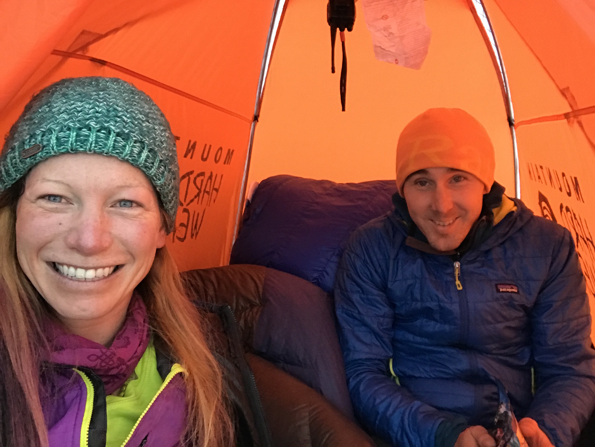
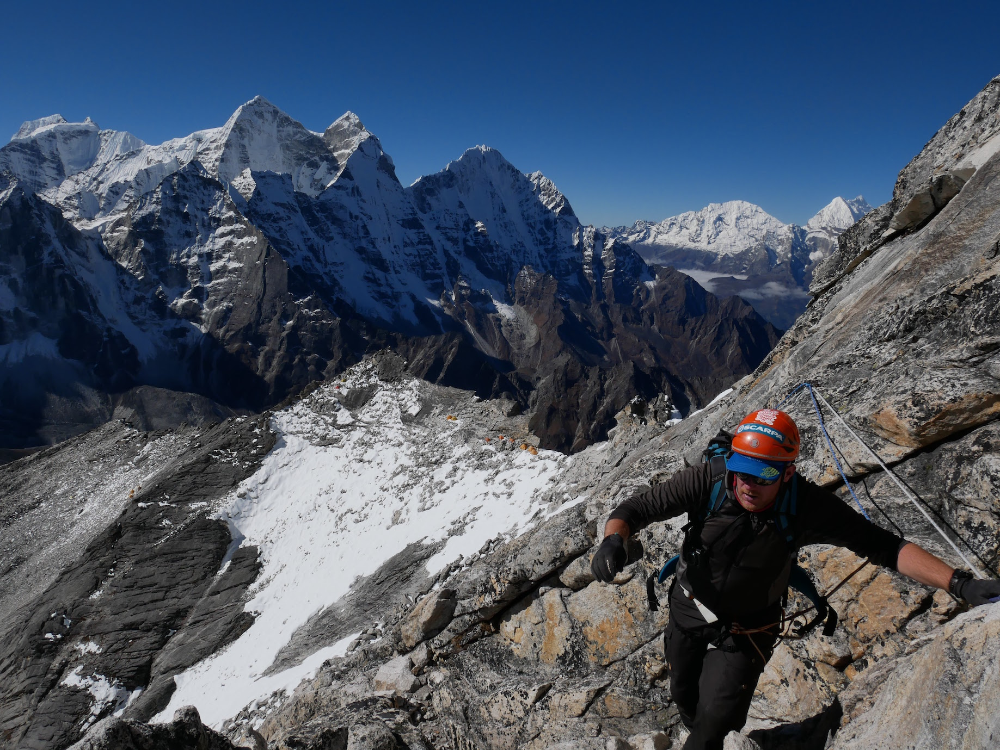
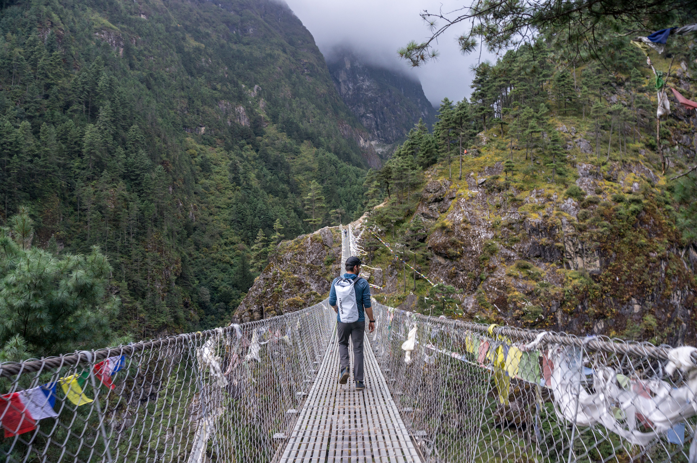
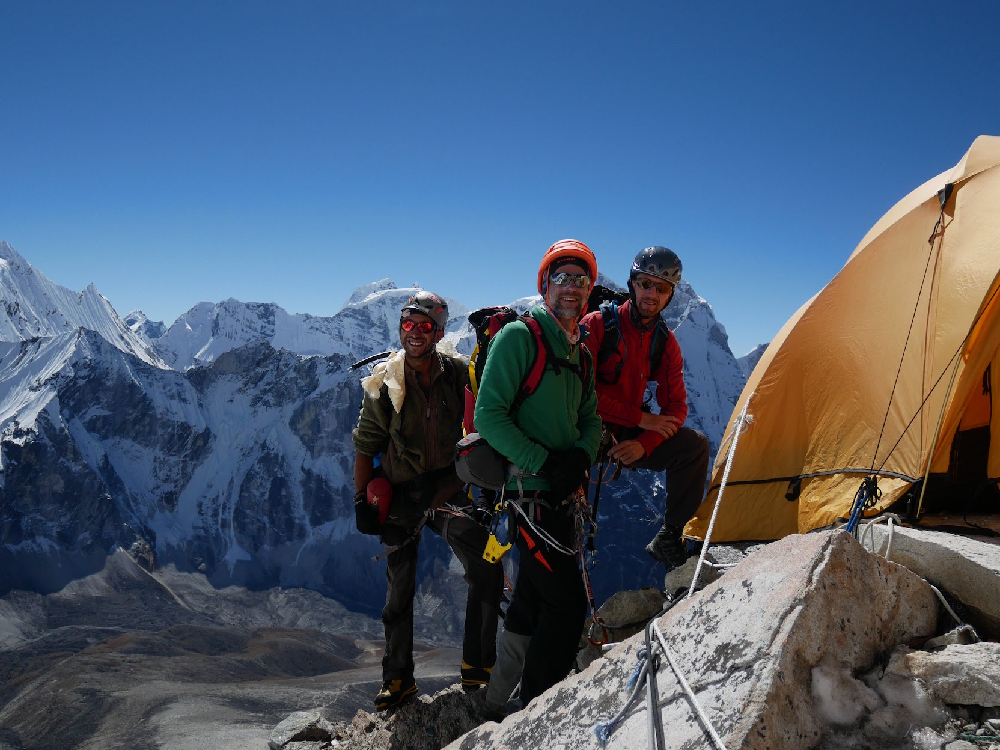

Before I tell you of my expedition to Nepal, let me introduce the cast of characters for this tale of ambition, hubris, persistence, introspection, and growth:

Grace McDonald - Badass Canadian climber with quite a few 8000m peaks under her belt, including Everest and Lhotse. Joined forces with me on Ama Dablam, since we both went without sherpa support.

Arnold Coster - Dutch climbing guide married to Maya Sherpa, the most accomplished female Nepali climber. Runs his own guiding company with logistics through Seven Summits, a local Nepali company. Made this trip super easy logistically for me. With multiple summits of Everest and other 8000m peaks, he also qualifies as a badass.

Richie Maybank - British Everest summiter who works private security in some of the most dangerous places on Earth. Badass

I met all three in 2012 on my first trip to Nepal and knew that I'd have fun spending extended time in the mess tent with them (not a common or easily inferred quality). Their plan was to acclimatize on Ama Dablam with the commercial expedition in order to attempt Cholatse (6440m) as a personal climb afterwards.

Patrick Chu - Guide for Alpine Ascents in the summer and ski patroller in the winter, Patrick has life figured out. Moving at a similar pace and climbing unsupported, Patrick, Grace, and I became an informal team, even sharing a tent on summit day.

Filip - Belgian software engineer for Pringles on his first Himalayan expedition

Andy - Belgian. Also works at Pringles and is on his first expedition

Rudi - Belgian climbing gear shop owner and experienced Himalayan climber

Will - The quiet Belgian

Eight of us were under Arnold's banner this expedition. Other climbers had come with Seven Summits, but we didn't interact as much with them:

Yadi - Chinese ultra-runner with little Himalayan or climbing experience

Zhangwei - Chinese Everest summiter and guide for Yadi

To be continued...