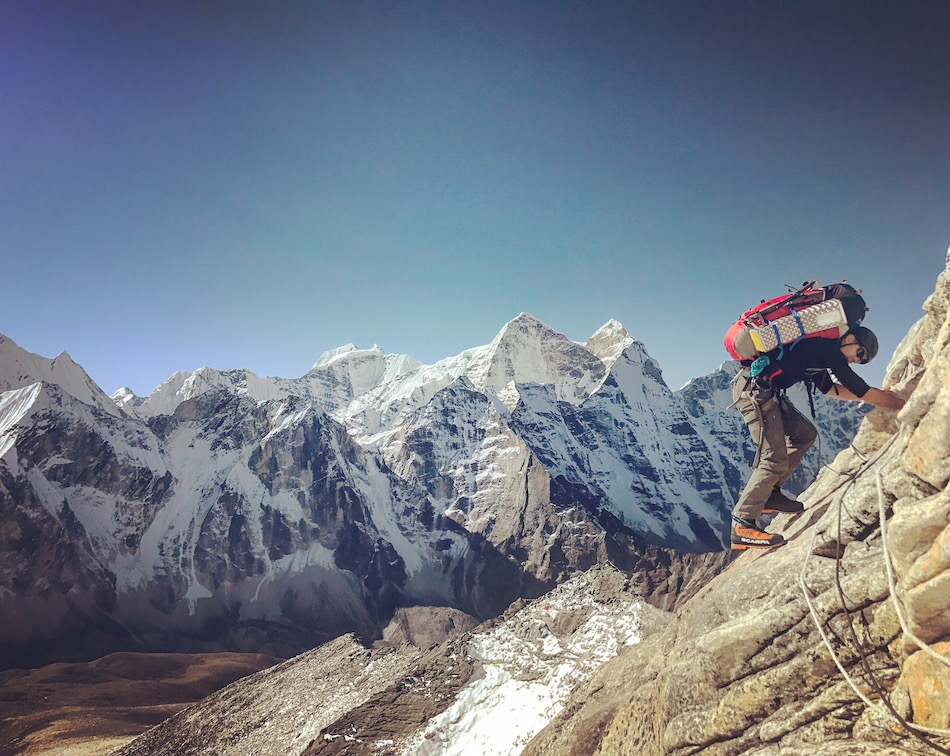
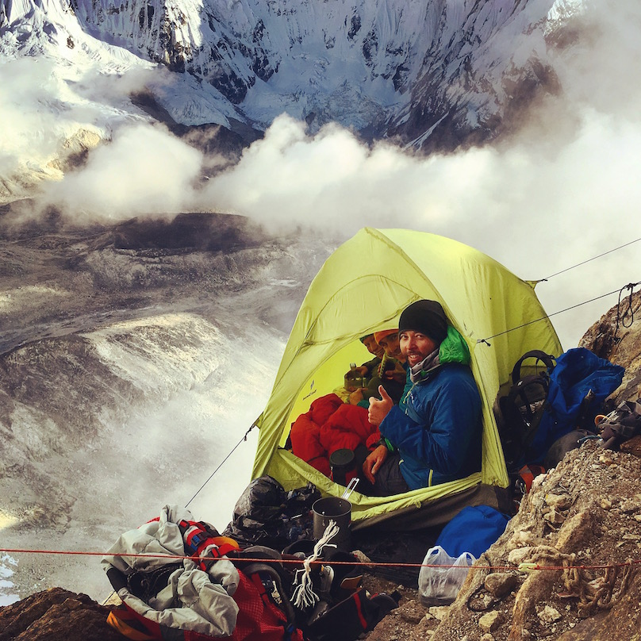
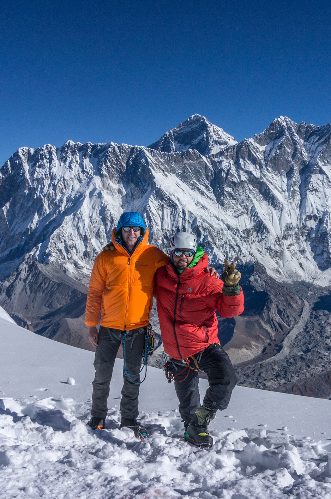
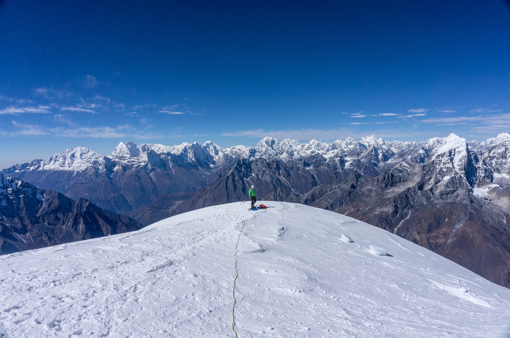

[Part 1 - Dramatis Personae](/taking-a-break-1/)

[Part 2 - Setting the Stage](/taking-a-break-2/)

[Part 3 - Tragedy](/taking-a-break-3/)

Grace and I arrived at Camp 2 early on October 30th and tried to get a little rest in the two-man tent we left dangling over the edge of the cliff. This was important, since Patrick would likely be joining us for the night. Arnold preferred Patrick start from Camp 2 after the Chinese debacle and there was very limited tent space on the jagged ridgeline.

Patrick arrived in the late afternoon, but Arnold had not found space for him in one of the larger shared tents. Slowly we accepted the reality of a "cozy" night and could only laugh at our situation.

Initially, we sat sideways with everyone in the tent. Slowly and uncomfortably, Patrick and I slid halfway out the door and Grace curled up at the foot. I didn’t sleep at all, vigilant for any shift in the taut guy lines until others’ tents began to stir with activity.

By midnight, we were en route and quickly joined the conga line on the gray tower. Steep snow, mixed climbing, and even overhanging ice steps made for some of the most enjoyable climbing of the trip.

Many of our group dropped out in the first hours. First, Richie started acting oddly and Arnold took him back down. Then, at Camp 2.8, Grace’s heated socks stopped working and she decided to go back down. The summit was not worth toes for her, especially having summited Ama Dablam five years before. Just as I reached the former Camp 3, Andy turned himself around, just not feeling up to it, especially in the bitter cold.

I pushed on as my will was tested further. Grace warned us about the wind across the shoulder at Camp 3 in the coldest part of the morning, but minus thirty hurts at 4am, whether or not you’re prepared. Around six hours in, halfway up the final face, I seriously considered descending. My toes were cold, I couldn’t feel the last digit of my pinky fingers, and each step had become infinitely more difficult with the altitude. Continuing to wiggle my toes, wearing mitts, and drawing on my mental toughness (or stubbornness) carried me for the final two hours to the top.

>"Worth it"

Ten or fifteen minutes later, we left the summit and began the more important half of the climb: getting down safely. Patrick confided that he did not feel right and asked me to keep an eye on him. I tried to stay close and make sure his rappels were set up correctly. Despite what seemed like mild HACE, the descent went off without a hitch. We even stopped for a minute to enjoy the view.

I left Patrick at his tent in Camp 1 and jogged into Base Camp in the dark, just in time for dinner...