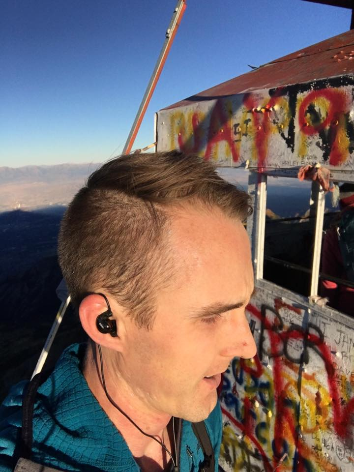
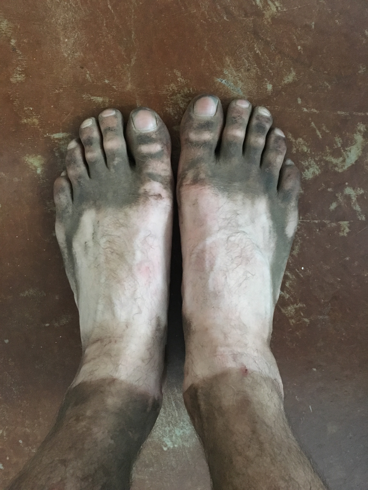

On Friday, since I had no climbing partner and no desire to drive somewhere for the millionth weekend in a row, I decided to stay local and work on my cardio. I vaguely remembered somebody mentioning that people had tried to hike Mt. Timpanogos, Lone Peak, and Mt. Olympus in a day, which seemed like an appropriately ambitious cardio challenge. However, I couldn't find anything online about it. I dubbed it the "Wasatch Triple", a linkup with 32.2 miles of hiking and 13,841 ft of elevation gain!

This morning I started driving towards the Timpooneke Trailhead at 4am, arriving just before 5 to find the parking lot already full. Luckily I found another spot that only added a quarter mile to the hike. I seemed to be moving at a good pace for the first 20 minutes, until I ran into a dead end. I tried to retrace my steps and find another way, but only wasted nearly a half hour. I had gone through a bend in the trail and saw the headlamps snaking up and right. As soon as I realized, I ran back down and started up the right way. I continued to make really good time and reached the summit in 2:38, even with my detour. The descent over the reasonably graded trail lent itself well to running and I hit the home stretch in an hour from the summit. Then, I started to bonk - never a good sign at the start of the day. I overcooked it coming down and had to walk-run the last 20 minutes to the trailhead.

Trying to recover for the next 5000 feet of up, I downed a Frappucino, a Powerade, some Shot Bloks, and a Lara bar. That perked me up a bit, but the tightness in my calves and the soreness of my soles wouldn't leave.

> Pro Tip: Don't wear minimalist shoes to run on talus, if you're not used to it.

At the bottom of Jacob's Ladder, I knew I had to fight through and just keep moving to even have a chance today. The calorie infusion wore off about a third of the way up the steeps and my pace slowed to a crawl. One foot in front of the other and no breathing through your mouth. Kanye's beats and egotism pulsing in my ears pushed me through the next two and a half hours of increasing agony. My stubbornness shouldn't come as a surprise to most, but the last 1000 feet epitomized the lengths to which I'll push myself.

The summit brought both relief and apprehension about going back down. I ate the last of my food and set out gingerly across the ridge. Just after the meadows, I took a break under a lone tree, trying to stretch out my calves and give my feet a break from the slip'n'slide. No improvement. Am I going to make it down before dark without pain killers? And why did I choose this day to not take my med kit? The first group passed and had nothing to offer but granola bars. I got up and hobbled down the trail for another 15 minutes, grunting to distract myself and moderate the pain. Finally, a very nice family came by with glorious ibuprofen and a fabulous turkey sandwich (that might be my desperation talking), which I happily accepted. By no means pain-free, but with the edge significantly off, I made the car in an hour and decided to call it. No Olympus for me today without some more ibu and a dose of stupid.

All in all, I can't be too sad about bagging two big peaks and finding my limit, but I've got some lessons to learn for next time. And some really dirty feet.

