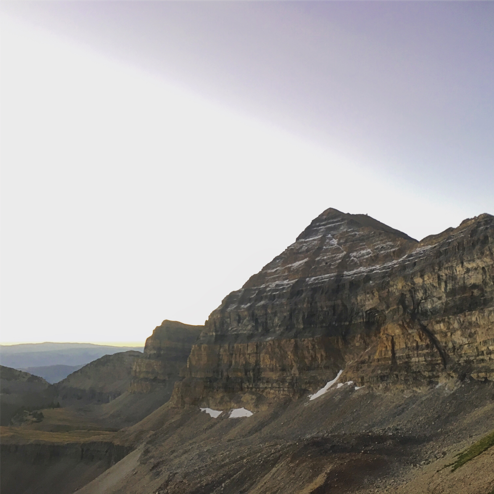
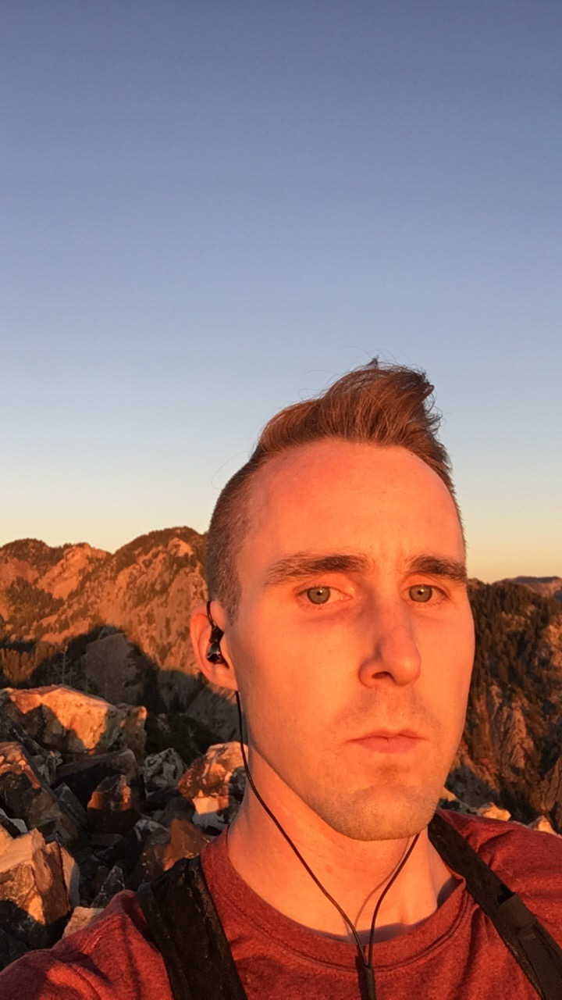

After getting shut down last weekend by logistics more than physical difficulty, I knew I had to give the Triple another shot. Saturday was out, since I slept from 5pm on Friday and didn't get out of bed until about noon. Stress... But Sunday's conditions looked ideal for a Timpanogos / Lone Peak / Olympus triple-header.

*3 Summits  
32.2 Miles Round Trip  
27,682 ft Up and Down*

I could attribute the empty parking lot at Timpooneke trailhead to my arriving half an hour earlier than last week. Or judging by it being only half-full, I could say that Sunday is the day to do things in Happy Valley. In either case, I avoided getting lost and kept my breathing through my nose on my way to summit #1.

Summit #2 started at 10:30am with controlled-effort plodding under the rising heat of the day. I went without music for the first two peaks, which gave the experience a different character than my previous effort - much more meditative and introspective than detached and masochistic. As I sat on the summit, two hikers carefully clambered up the last moves and crawled onto the summit block, apparently a little overwhelmed by the exposure. I couldn't help but chuckle in my head at their repeated expressions of relief at being done, while I thought about Olympus.

Earlier in the day, I started to notice that my stomach didn't feel well. At the base of Timp, I made liberal use of the toilet and made sure to add some toilet paper to my pack. Coming off Lone Peak, I knew I had eaten something wrong, but didn't know what it could be. The only difference in my diet was the six packets of GU I had consumed by then... Ingredients - Gellan Gum, which I swore off after some coconut milk, with it as an additive, turned my ass into a fountain (or a shower, whatever image you like). No more GU for me.

A quick trip to Five Guys for a burger remedied the lack of trail food after my revelation and powered me up Olympus. The sunset on top was a brilliant ending to a trying day, truly one of the harder things I've done. I can't say I enjoyed it or that I'll do it again, but it was worth all 77,624 steps.

