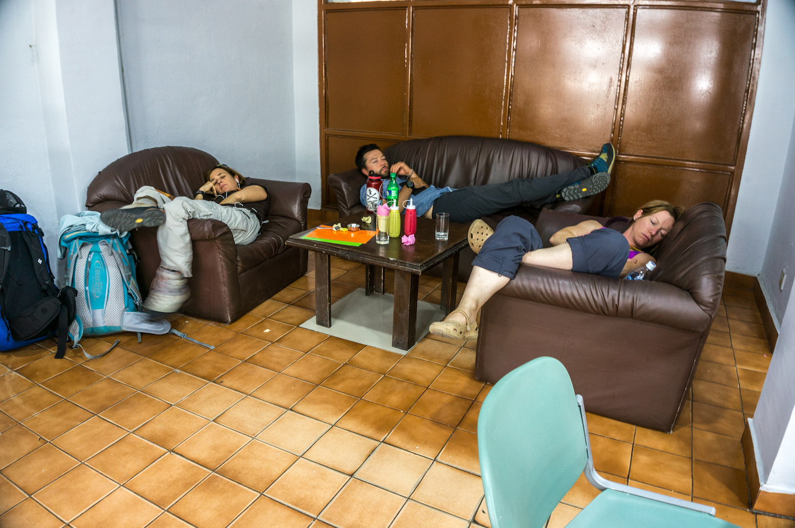
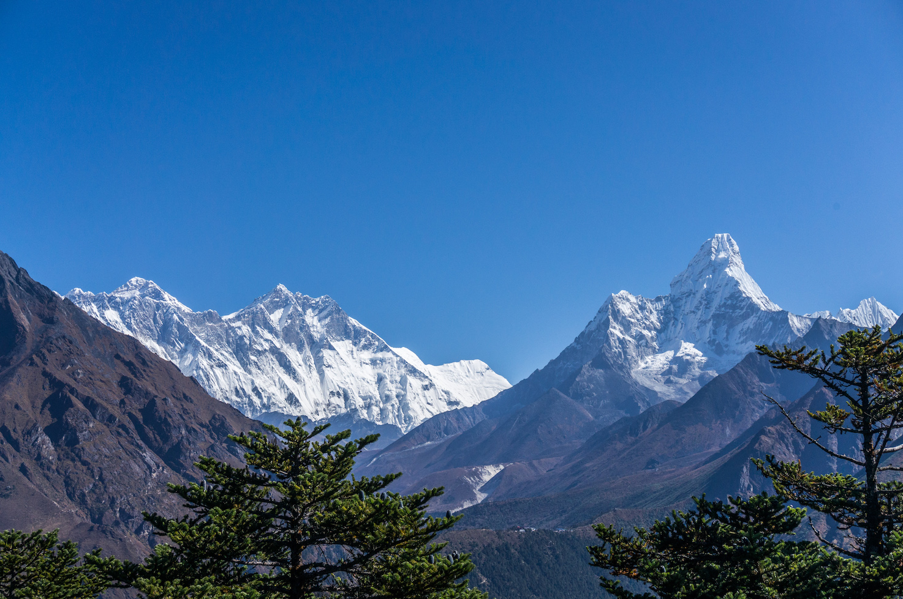
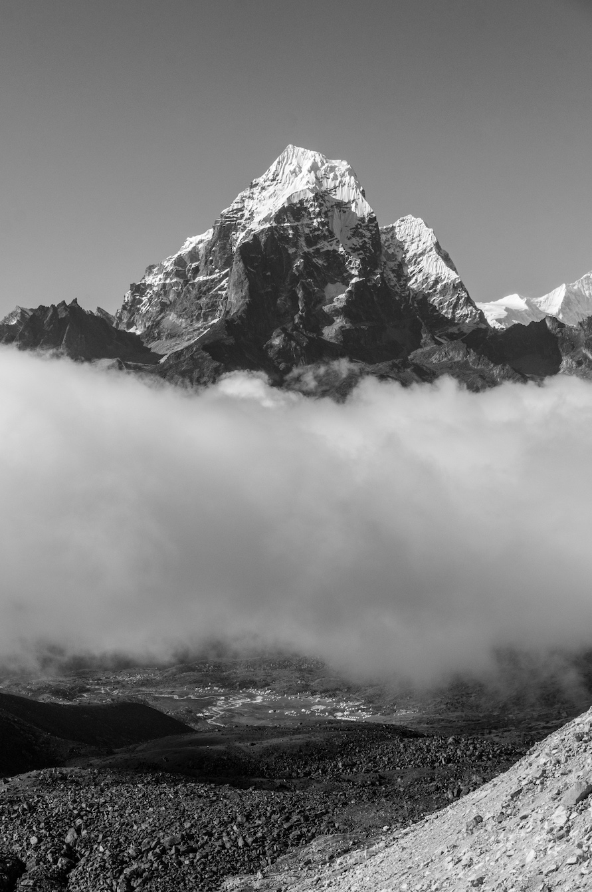
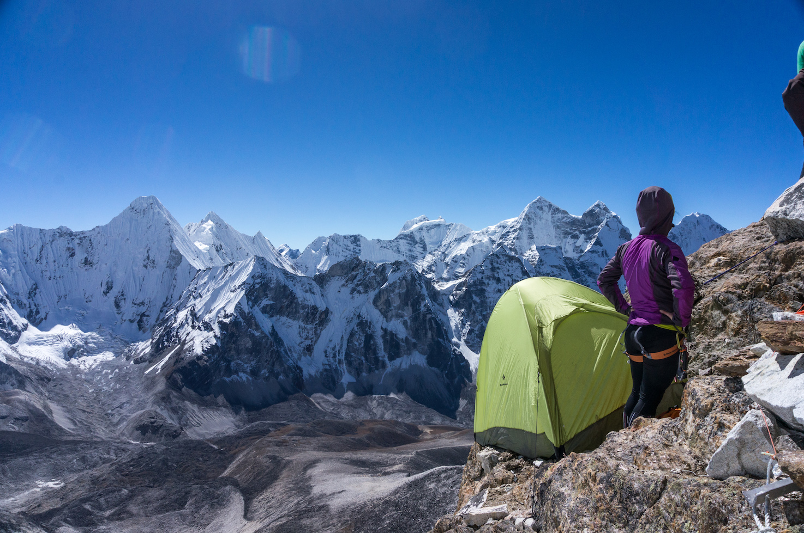

[Part 1 - Dramatis Personae](/taking-a-break-1/)

It's taken me a while to process the whole experience. A month in Nepal, away from the distractions and complications of daily life, unreachable except by satellite, works great as a "hard reset". Returning to "real life" provided the contrast necessary to crystalize decisions made in the shadows of Ama Dablam. But I'm already ahead of myself...

On October 14th, I landed at the chaotic Kathmandu airport, found my driver amongst the hundreds of sign holders pressed up against the parking lot barricade, and arrived at my hotel properly exhausted. A few days later I was back at the local terminal, hoping to catch a flight to Lukla, the start of the trek into the Khumbu Valley. Clouds often shut down flights and waiting can get boring...

We decided to upgrade to first class and took a helicopter the next morning instead, so we wouldn't spend the rest of our trip passed out in the Kathmandu airport. From Lukla, a well-traveled trail follows the river before climbing into Namche Bazaar.

Two nights of acclimatization at 3440 meters gave us the lung capacity to make it to Tengboche, home of the famous bakery (get the apple crumble) and some of the best views of Ama Dablam.

Finally, with the blessing of Lama Geshe, we set off for Base Camp on the 20th to find our home for the next two weeks. Grace and I decided to push to Camp 1, or as far as we felt comfortable, the next day to push our acclimatization further. Normally, ascending nearly 2000 meters in two days is inadvisable, but we kept our packs light and our pace moderate.

With a rest day and a night in Camp 1, we were ready for Camp 2 and the start of the real climbing. Between Camp 1 and Camp 2 lies 3rd to 5th class rock interspersed with snow and ice. The final step to 6000 meters - the Yellow Tower - clocks in at 5.8. I freed all the rock sections that day, my solo mileage in the Tetons and the Wasatch over the summer paying off.

We found the last (and most terrible) bivy spot at Camp 2 to set up my tiny green tent. But at least we wouldn't have to negotiate for tent space with other expeditions.

As the drama and bickering about late rope fixing spread through base camp, we rested and patiently awaited our chance for the summit. I entertained myself with hours upon hours of paper-crane-folding meditation and non-fiction literature. Around the dinner table, the card game "Shithead", stories of previous expeditions, and crass jokes predominated.

Higher on the mountain, other climbers waited right behind the fixing team, aiming to be among the first to reach the top. Many would succeed, but a few flew too close to the sun...