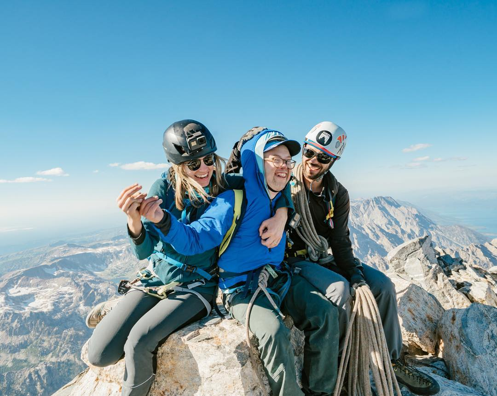

After 27 straight days at work, I needed a break. I was sick, stressed out, and hadn't gone to the gym in 3 weeks. Four days in the Tetons offered me the chance to reset with a good dose of solo suffering. 

By the end of the trip, however, it was clear that community, rather than solitude, had been the answer.

##Friday

I rolled into Grand Teton National Park late Thursday night, hoping for an early-morning start and a personal record car-to-car on the Grand. At 10,000' I began to realize the folly of a speed attempt without acclimatization. An AMS headache pounded dully behind my sinuses as the thinner air weighed heavily on my legs. My pace slowed and I hoped to make time up on the descent. 3:58 to the summit meant no chance of a sub-five-hour day.

Profligate with my glycogen on the way up, fat powered my repentant, walk-jog-walk descent. An approaching group pulled me out of my head. They were guiding a man with Down Syndrome through the boulder field below the Meadows.

For my non-climbing friends, some context: there is no route to the top of the Grand Teton that is not normally climbed with a rope. I measured a vertical gain of 9,000 feet and round-trip distance of 16.1 miles that day. The summit sits at 13,776'.

**This was a surprising sight.**

A few days later I learned that Ducky became the first person with Down Syndrome to climb the Grand.

*[Instagram](https://www.instagram.com/p/BYPCFuLH0Qk/?taken-by=patagonia_climb)*

I thought as I ran past, "These are some really quality people. Keep it up!". The overwhelming response on social media shows I was not the only one so inspired.

As I continued down the mountain that day, six parties asked me if I had summited and how fast (I started counting after three did). They were all stoked for me and offered plenty of encouragement. I didn't set a PR, but I couldn't be disappointed with my time after such an incredibly positive, uplifting day.

##Saturday

On Saturday, I ran up the Upper Exum to the top of the Grand, passing a large Russian contingent and one of the parties that had encouraged me the day before.

>Man in 50L pack: "You're going up again?!"
> 
>Guy in running shorts: "Yeah..."

##Sunday

I do take rest days. Sunday was spent in a meadow, reading two books and eating mac and cheese. Mmmmm

##Monday

I fully expected the summit of the Grand to have a few hundred people for the eclipse, yet be one of the least crowded places in the park. Apoceclipse never came to pass though. Just fifty people gathered over the course of the morning. Some of the earliest brought up a 360-degree camera and strapped its tripod securely to the summit block. As others arrived, they collected emails, so everyone would have the footage.

Someone announced loudly, "I think I'll get along with anybody who came up here for this. They're probably all cool people". I nodded my head in silent agreement.

A few minutes before totality, as the dimmer switch came down, a group of strangers watched the shadow of the moon cross Idaho. Gusts of wind raked the summit and the temperature dropped rapidly. I shivered violently in my jacket but only felt immense awe while the world fell into shadow.

<video autoplay="" loop="" style="max-width: 100%;">
  <source type="video/mp4" src="https://i.imgur.com/ldjQtba.mp4">
</video>

Two minutes later it was all over.

I felt small. Events on the scale of the solar system can cause that; so can the reminder that you have the balls to free solo but not to talk to people. On this trip, I chose to seek solitude when small acts of community made me feel so much better. Stress causes us all to regress to places of known comfort instead of seeking challenge and growth. I came away from this break a little less stressed and a little more motivated to engage the quality people in my life, and the ones I haven't met yet. I hope you will be too.