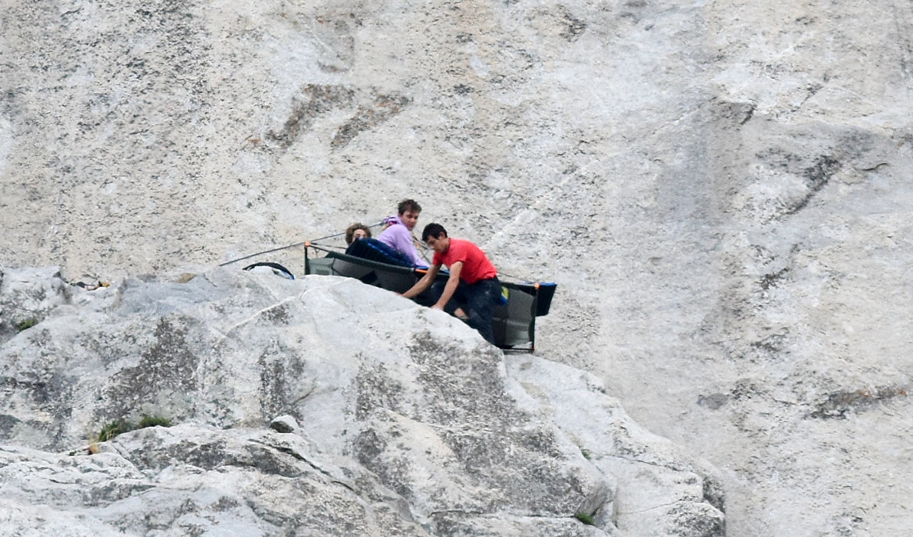
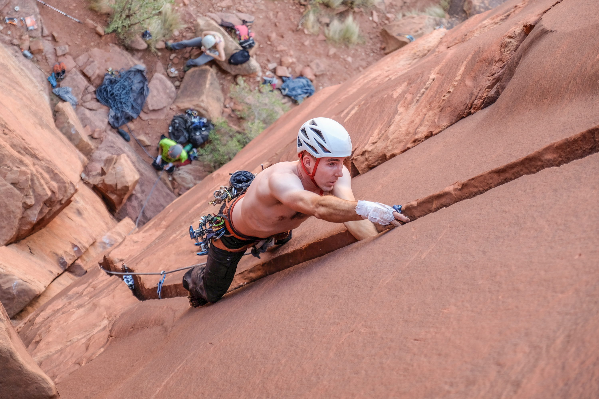
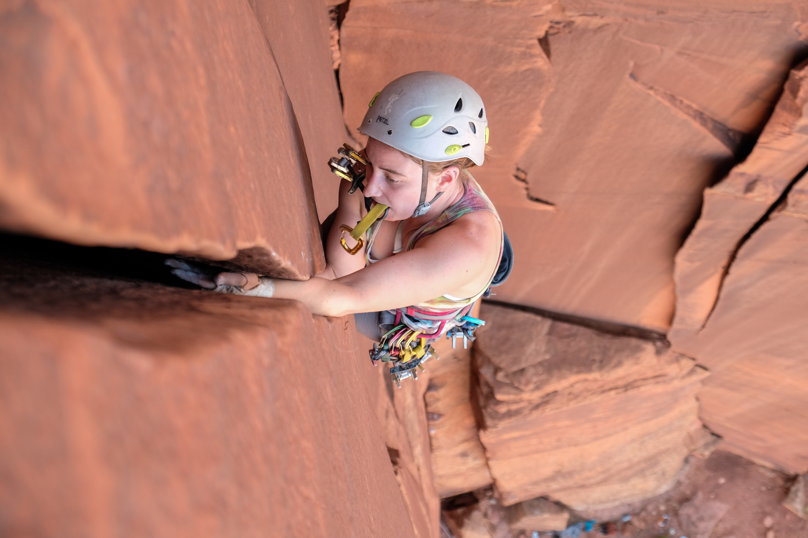
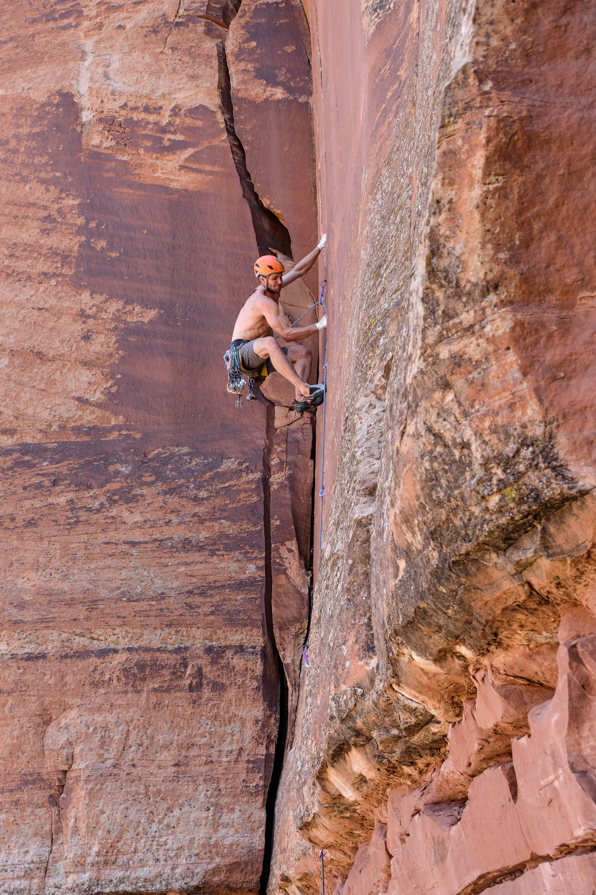
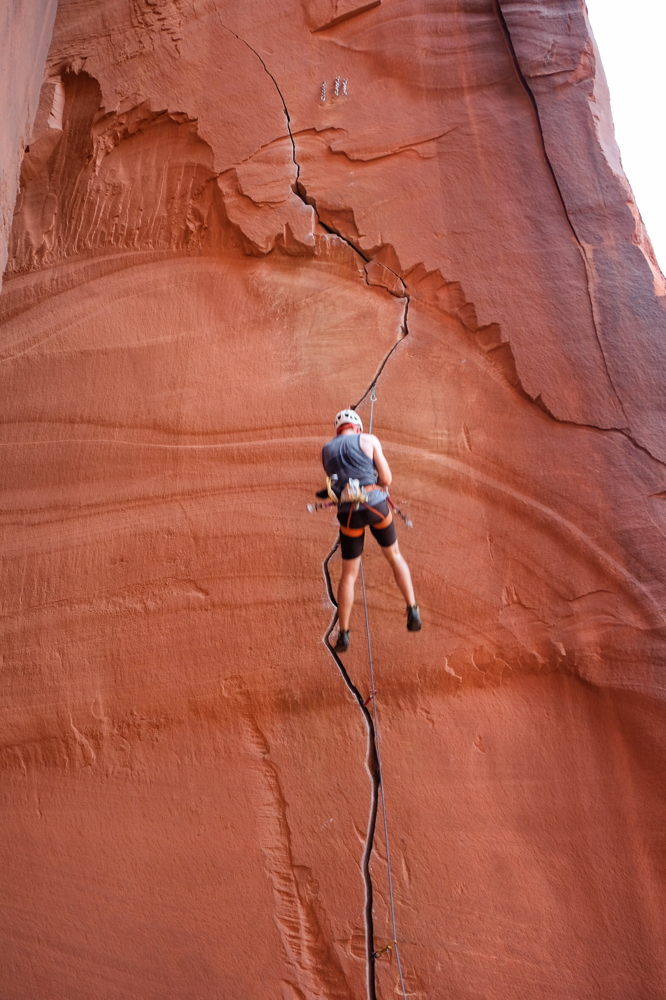
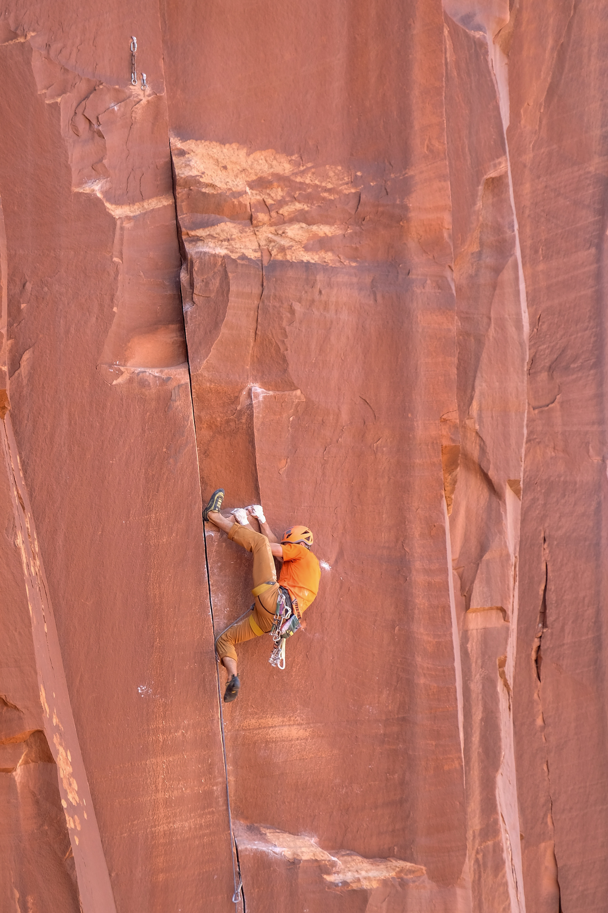
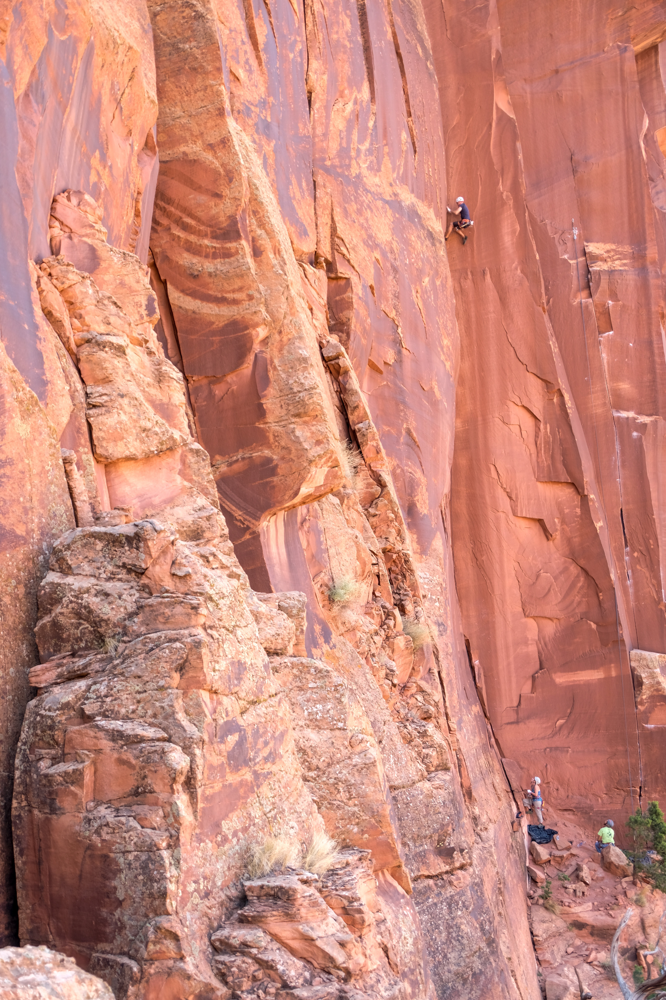

In keeping with my committment to seek out quality people, I was excited to meet up with Forest and some new friends for a long Labor Day weekend. You may know him as the guy in the [Unicorn onesie](https://www.rei.com/blog/climb/the-climber-in-the-unicorn-suit) during Honnold's Freerider free solo.

I know him from just over three years ago, when I set out on my job-search-and-learn-to-rock-climb road trip. He had a consistent stoke and kind demeanor when we first met off Mountain Project in Grand Junction, CO. We met up a few weeks later to climb Whitney and Russell while cursing persistent and successful marmots. We didn't climb together again until this summer in the Black Canyon of the Gunnison, but Forest commented on this trip that I'm pretty much the only Mountain Project partner he's kept in touch with. That respect is mutual.

Forest connected me with Julia, since we're both Salt Lake dwellers, and we met up on Thursday afternoon for the ride down to the creek. A short stop to borrow a third #6 for Forest's offwidth proj and we were on our way.

Completing the crew was Ernest, a friend of Forest's also from Los Alamos. I remember them saying there were about eight climbers in Los Alamos, so it was an honor climbing with 25% of the community.

##Reservoir Wall

On Friday, we woke up to a nearly empty Indian Creek and had the Res Wall to ourselves all day. I got on Pente (5.11-) again, a route I couldn't redpoint last year, and sent! The top section of finger stacks in a corner felt much less desperate this time.

The slot section of Slot Machine (5.11+) still beat me up, although my technique got better. I might have a chance next time with a more restful knee bar. Ninja (5.11+), power laybacking on .5s, felt absolutely impossible. A theme began to emerge - I've reached a technique limit; I'm just not strong enough.

##Cliffs of Insanity

To get warm, we hopped on M.C.'s Hammer, a classic big-hands 11-. I got nice fists in while Julia swam up to her shoulders low on the route. We kept warming up on offwidths for her, but she kept rising to the occasion. Forest and I got that experience next.

*Me on M.C.'s Hammer by [@faltherr](https://www.instagram.com/faltherr/)*

*Julia on the fun part of M.C.'s Hammer by [@faltherr](https://www.instagram.com/faltherr/)*

Forest had expressed interest in trying Lobotomy (5.11+) and had collected the required gear, a double rack plus three each of 4s, 5s, and 6s. He took out the long-sleeved shirt, taped his sleeves and pant legs down, and prepared mentally for war. The first 40 feet took him 15 minutes. The next 20 feet of #6 crack took 45 minutes. Although he didn't onsight, he put up a hell of a fight. He rubbed his ankle raw, scraped up his shoulder quite badly, and most ignominously, got a butt gobie. Badass, pun intended.

I seriously reconsidered even taking a top rope lap. I did though and figured out that I don't mind 6s so much. 5s are the killer size, if the knee doesn't fit in.

##Petrified Hornet & Optimator

After failing to find 4x4 Wall parking and seeing that it was still in the sun, we decided to try Petrified Hornet. Across from Optimator, it is one of the less visited walls, but had a few quality routes. Forest put up Sting (5.12) and the rest of us took turns cursing offset .5s and .75s.

*Forest feeling the Sting*

Of course, the best way to follow flailing is with more flailing. We skirted the rim to Optimator and I took a run at Annunaki (5.11+) where I fell three times near the top. Not terrible. 

*Taking the whip on Annunaki by [@faltherr](https://www.instagram.com/faltherr/)*

##2nd Meat

Before going home, we had to take one more beating (or at least I did). Forest still had some gas and got the redpoint on Xtra Lean (5.12-), which felt like bouldering on a rope.

*Heel hooks for days*

I attempted one last time to get a mid-11 onsight with Top Sirloin (5.11). The super-consistent small 1s were too much for me in the upper overhang and I got spit out.

*Photo by [@faltherr](https://www.instagram.com/faltherr/)*

I tend to get down on myself after a trip like this. However, I know I haven't been training effectively for hard rock climbing. I need to focus on strength training, especially with ice season coming up. Who wants to join me for hangboarding and ice tool hangs all fall?