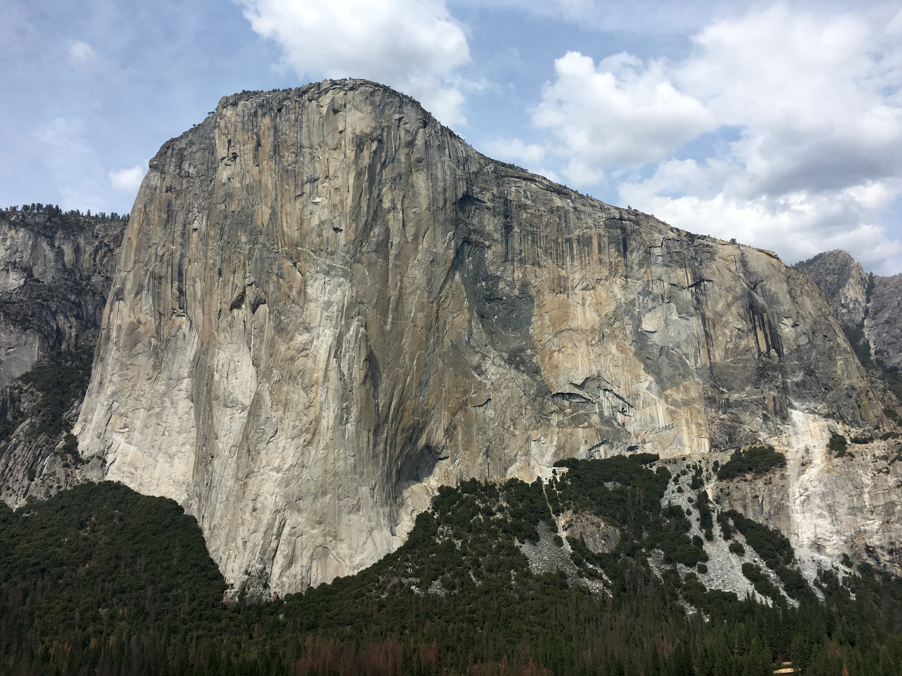

##The Search

I spent months researching camping vehicles. From Tacomas to Sprinters, Westfalias to Transits, I knew all the options, but each one had its downsides - you have to get out of a truck to get in the cab, you have to pay $50,000 for a 4x4 Sprinter, you would pay not much less for a Syncro, etc. In the end, I wanted something I could customize without breaking the bank, that had four wheel drive, and was smaller than a modern van.

If you've ever been to Vancouver, you've probably seen a [Delica](https://en.wikipedia.org/wiki/Mitsubishi_Delica). They look like lego bricks on wheels, chugging along in the slow lane. A few importers have made a living bringing Japanese-made cars to Canada. Only the ones that are at least 25 years old can be imported into the U.S.

I had considered one, but didn't want to wait months to a year for the right one to come to auction in Japan, buy it, put it on a cargo ship, and pick it up at the dock. With some luck, I found Totoro, already in Vancouver. I booked a one way ticket and had the keys by the next afternoon!

*Yes, the steering wheel is on the right side*

*Totoro's namesake, from the classic Miyazaki film [My Neighbor Totoro](https://en.wikipedia.org/wiki/My_Neighbor_Totoro)*

|1991 Mitsubishi Delica L300|
|------------|-----------|
|Engine|2.5L Turbo Diesel|
|Mileage|~53,000|
|Transmission|4-Speed Automatic|
|Drivetrain|4WD|
|Steering|On the wrong side|

##The Journey

Totoro seemed in good mechanical condition, but I was going to put him to the test. I planned to follow a 1,700 plus mile path along the Oregon coast, through Yosemite, and back to Salt Lake.

On the first day, I successfully navigated customs and Totoro was allowed into the Greatest Country on Earth™. Bellingham, Seattle, and the Oregon border rolled by the window. Ah, Portland! The dream of the *foodies* is alive in you. Three amazing restaurants and a coffee shop later, I charted a course to the ocean for the evening.

*Morning on the Oregon Coast*

A long day from the temperate rainforest put me in Yosemite Valley. The Camp 4 line was twenty people long at 5 AM. Four hours later I had a campsite and met someone to climb with. There's always somebody around and quite a few of them are characters. This guy had climbed Royal Arches with Dean Potter in fourteen minutes and dragged himself twenty miles with useless feet after his partner pulled him into a crevasse. Another had done the first ascent of [Mount Pomiu](https://en.wikipedia.org/wiki/Mount_Pomiu) in China with Allen Steck.

*The Captain*

All in all, I climbed a bunch of classics, including Serenity & Sons in a serious downpour and The Rostrum, where I climbed much better than two years ago, only falling on the second-to-last pitch.

Sadly, just a day after I left, a large section of the east face of El Cap peeled off the wall and [killed a climber](https://www.nbcnews.com/news/us-news/climber-killed-rockfall-yosemite-s-el-capitan-trying-save-wife-n806191). I walked under that section just two days earlier.

##Home

As soon as Totoro got home, I started with my improvements. It's going to be months before he's really "finished", but I'm shooting to have a functional interior for Creeksgiving.

So far I have...

- Upgraded the head unit and speakers
- Installed a pyrometer
- Tinted the windows
- Stripped out much of the interior
- Plastidipped the wheels
- Researched so many things

*Out with the seats*

*Hidden treasure - a Sailor Moon chopstick!*

*The red wire goes where again?*

*A random friend in \#vanlife*

*Interior stripped up to the windows*

*Sexy, black wheels*

Still to do...

- Install sound deadening
- Install insulation in the floor, walls, and ceiling
- Install flooring and wall coverings
- Paint the exterior
- Paint the bull bar
- Install a snorkel
- Build a bed platform
- Build cabinets
- Install second battery and electrical
- Upgrade shocks
- Add a leaf to the back suspension
- And more!

Does anyone have a garage and/or driveway I could use? I'm working out of a storage unit and down by the train tracks, since my underground parking is not conducive to automotive work. I need to get Totoro looking like this:

The story of Totoro and our climbing adventures will continue...
