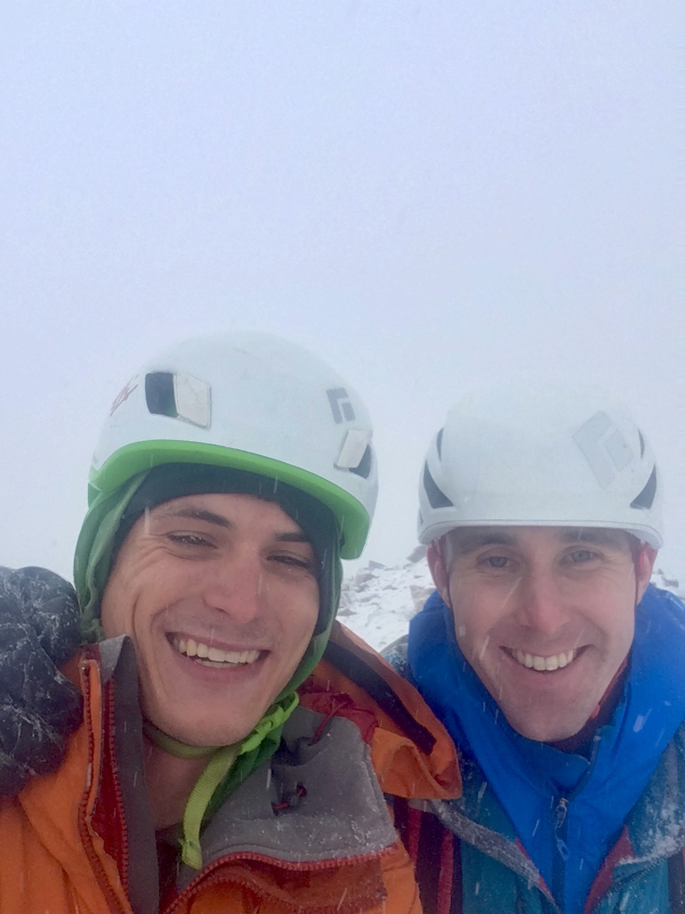

Ryan and I took shelter behind an ineffective stand of trees and shivered. It was 7:30 in the morning and a steady gale ripped around the ridge near the base of Ostler Peak. "I'm wearing all my clothes and I'm still cold," I thought. "Why am I doing this?"

##The Idea

At the climbing gym on Thursday, Ryan asked if I had seen the [trip report](http://www.pullpublishing.com/blog-1/2017/10/31/siren-song-ostler-peak-amethyst-basin) of a new route that got put up in the Uintas. I had seen a Nathan Smith's photo on Instagram, but not the full TR, and said it looked cool. Not a minute later we were planning to do the second ascent on Saturday.

*[pullphoto on Instagram](https://www.instagram.com/pullphoto/)*

I had some reservations: We would be trying to beat a snow storm that evening, pitch 5 could be like playing life-or-death Jenga, and it would be our first ice climb together and of the season. These were outweighed by my confidence in Ryan's abilities and decision-making, which I'd seen in our first rock climb together.

##Committing

We decided to keep moving and let the snow-covered-talus slogging warm us up. The wind abated, blocked partially by the peak, and I shed a layer.

The first few pitches went reasonably quickly and I started to feel more in ice-climbing shape. Pitch 4 was the first challenge.

>Once I reached the steep pitch 4, I started up, intending to solo but brittle ice dinner-plating caused me to back off and pull out a rope. The steeper pillar had blue plastic ice, so I switched to the left and brought Matt up. [- Nathan Smith from the TR](http://www.pullpublishing.com/blog-1/2017/10/31/siren-song-ostler-peak-amethyst-basin)

We found no plastic ice anywhere on the route. Every tool placement shed dinner plates at least twice, normally three times. It was exhausting work, but I made the ledge and brought Ryan up.

##Jenga

New snow had fallen since the first ascent and continued to fall through the last half of the route. A fresh two inches coated every horizontal surface of pitch 5's death-block maze. Ryan kept his gloves on and set off.

>It looked like 5.2-3 on rotten rock but ended up more like 5.6-7 on HORRIBLE rock. Matt took the pitch and did a great job weaving in and out of stacked blocks ready to fall and crush us. Once I followed, I realized just how bad this section was. Almost no pro and a fall as a follower would result in significant damage if not death. Luckily, neither of us fell. [- Nathan Smith from the TR](http://www.pullpublishing.com/blog-1/2017/10/31/siren-song-ostler-peak-amethyst-basin)

We climbed further right, taking a short 5.9 section in reasonably good, protected rock before traversing back left on the loose, sparsely protected 5.6-7.

As I turned the corner to the final traverse, Ryan said, "I'm glad you didn't fall on my anchor." That messed with me a bit as I looked at a best-case, twenty-foot swing into the wall next to the pillar. The anchor was actually pretty solid for tied-off stubbies, but I wouldn't hang a car from any belay on this climb.

##Let's Finish This Thing

I pushed the rope up under the overhang at the base of pitch 7. At this point, it was snowing up to an inch an hour and spindrifting constantly. The slopes across the basin, dry that morning, were coated in a few fresh inches.

Ryan did great on pitch 7 and Pitch 8 was luckily easier than expected (felt like WI3 chimneying). The greater challenge was swimming through spindrift. After some sketchy snowy kitty litter, we reached the ridge. With the weather deteriorating, we chose to head down and skip the summit.

All in all, it was a great alpine adventure with some quality ice climbing. If I did it again, I'd want the pitch 5 pillar to be in. And maybe try it in nice weather...

