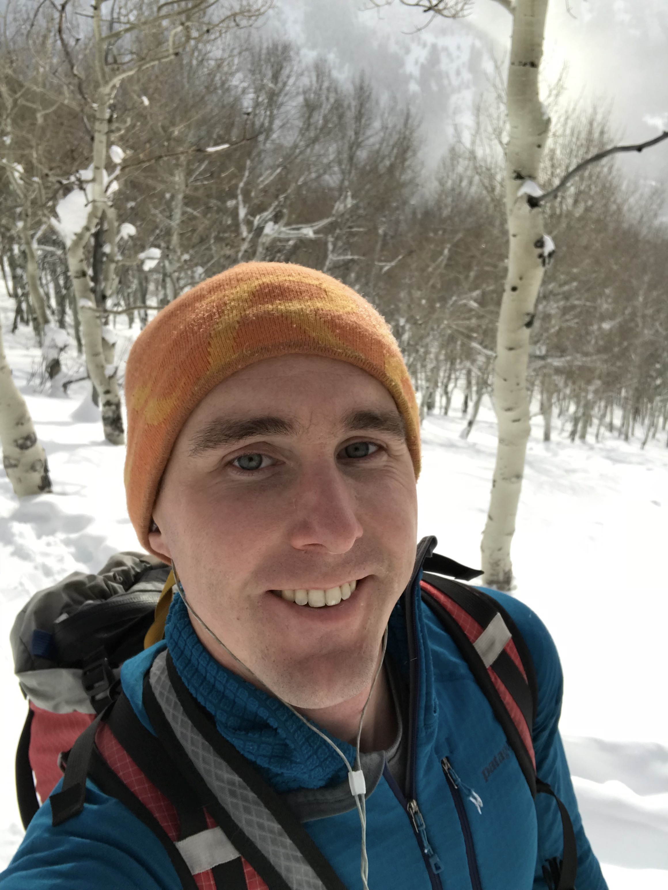
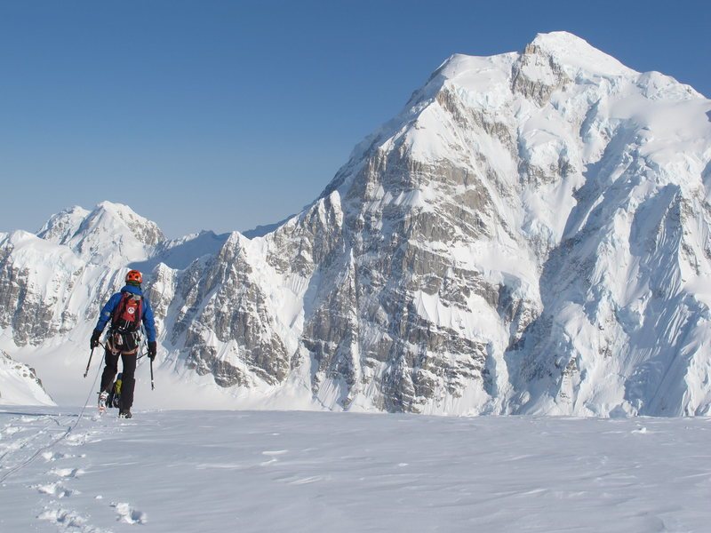

##Motivation

More than a few of my posts contain complaints about work. The gaps in my posts here are silent testimony to the same pattern - I let work consume me and failed to let climbing feed me.

So I quit.

It took me a long time to get truly comfortable with that decision and realize what I needed to do to avoid repeating the same mistakes. I decided to build my life around my passion, then fit the other priorities in. The jury is out on the sustainability of such a life, but I've become a much happier person by spending my time more authentically.

##Commitment

In early February, I reached out to [Uphill Athlete](https://www.uphillathlete.com/), brainchild of Scott Johnston and Steve House, authors of Training for the New Alpinism (TFTNA). Scott got back to me and we discussed my situation - I could car-to-car the Grand Teton in under six hours but had an [aerobic threshold](https://www.uphillathlete.com/forums/topic/aerobic-threshold-definition/) almost 50 bpm below my anaerobic (133 vs 179). According to the book, your aerobic threshold should be within 10% of your anaerobic threshold before training at higher intensities.

Scott was cautious in diagnosing [aerobic deficiency syndrome](https://www.uphillathlete.com/aerobic-deficiency-syndrome/) and we tested my aerobic threshold first. The lab test proved right; no training above 130 bpm for me. However, contrary to how I tried to train following TFTNA, Scott planned most work at my aerobic threshold instead of below in Zone 1. The amount of Zone 2 work that you can do with aerobic deficiency has been the biggest revelation for me so far.

Read about [Adrian Ballinger's experience](https://www.uphillathlete.com/adrian-ballinger-and-everest-everestnofilter/) to see what I'm trying to do.

##Sweat

I live for training now. Three days a week I skin uphill for hours. One day I do ARC training. Two days I lift and do core work. One day I recover. Every day I love what I'm doing.

*Training selfie!*

I will admit that it's hard not to climb while doing this base work. I'll miss out on a lot of good ice this season. I've also been called "grandpa" for my measured pace skinning uphill with a friend. But is building an aerobic base that will serve me for the rest of my life worth it though? Yes. Yes it is.

##The Prize

This is also pretty cool...

*[Begguya's North Buttress](https://www.mountainproject.com/photo/108487226)*

My partner and I will be attempting the Bibler/Klewin on Begguya (Mt. Hunter) this year, assuming conditions come together. It follows the center of the buttress through climbing so classic that sections have their own names - The Prow, The Shaft, The Vision. 

Every ounce of strength and conditioning I can squeeze out between now and May/June makes the physical challenge less likely to be the cause of failure. Let's see how strong I can get!