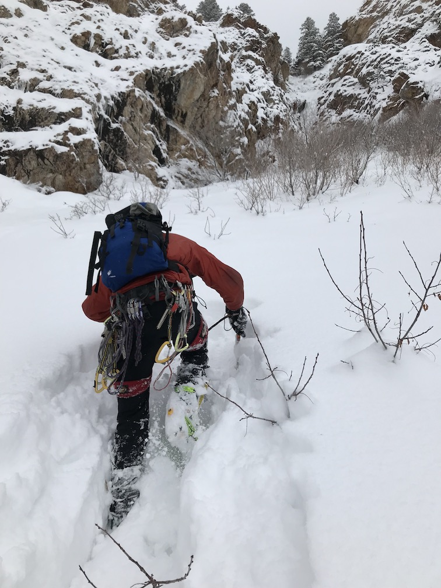
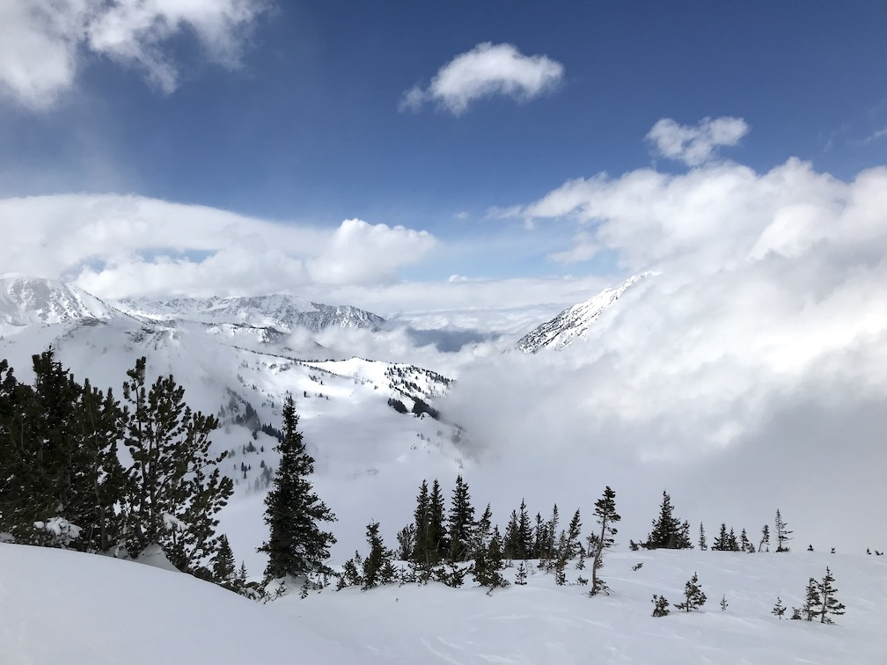
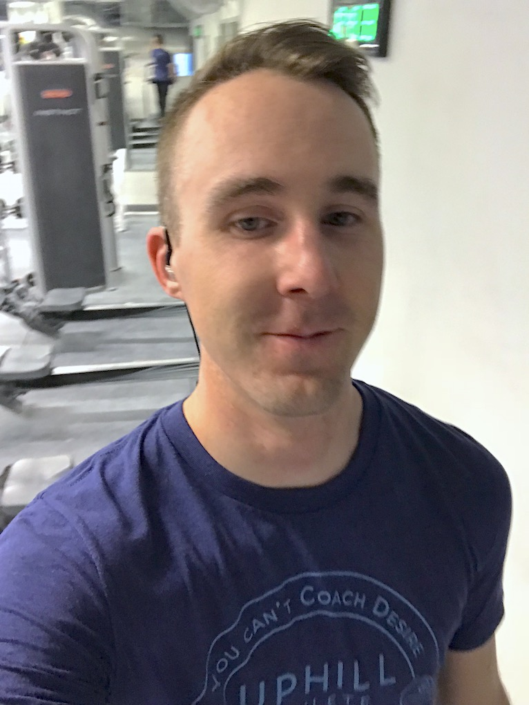

##More Sweat

As is the case not just in training, a lot of repetitive work can wear on you. In training, either the goal is so immediately present that any workout is rewarding (difficult to maintain) or you need to spice things up. Being able to get outside backcountry skiing is a life-saver for me when the prescription is five hours of moving uphill at a nose-breathing pace, carrying enough water to sate a football team's thirst. Even better when your friend wants to sneak in a quick pitch of ice in the middle, right...?

If you sense foreshadowing, give yourself a pat on the back. Instead of a jaunt up some rarely climbed ice in Mineral Fork, we spent three hours post-holing in bottomless powder between the first step of ice and the "real" pitch above. Luckily, my heart rate settled in at the right level while breaking trail most of the way. Good Alaska practice.

About 50 feet of nice climbing plus some of the shittiest, delaminating crap I've ever lead was our reward. Ryan got concerned after the fifth child-sized block rained down and the rope had moved imperceptibly for a half hour. I responded that I was fine (just being very careful to climb the solid blocks and not the bags of frozen peas). My excavation revealed enough good ice to finish the pitch. After a month without ice climbing, I was still grateful to get some.

Most of my outside adventures are mellow tours with views like this. I'm so lucky to live so close to the mountains.

##Progress

Remember when my aerobic threshold was only ~130bpm? And the goal was to get that as high as possible? Well, it's now ~148bpm! Just a month of dedicated low-intensity work made for a 15% increase. That also helps with the motivation for monotony.

##Swag

Part of the perks of paying someone to coach you is the cool t-shirt you get to crank out hundreds of squats and lunges in. Check it out.

*\#trainingselfie #swagtastic #youcantcoachdesire*

I'm going through two overreaching phases, one now and one in the middle of April, since I have week-long trips the first and last weekends in April. I'm going to get just tired enough before I leave to get a good super-compensation effect. In my next post, I hope I can talk about great gains in strength too!