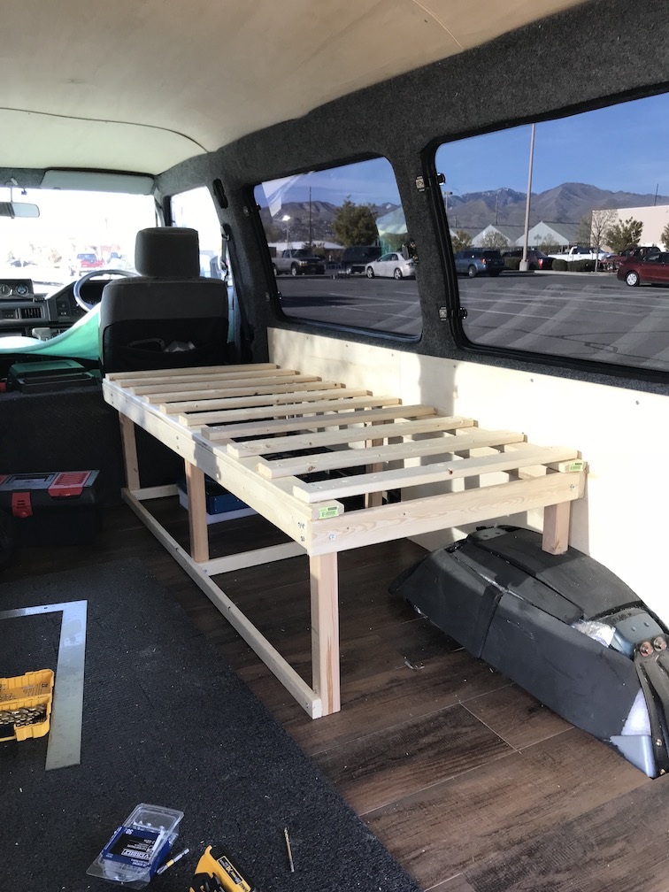
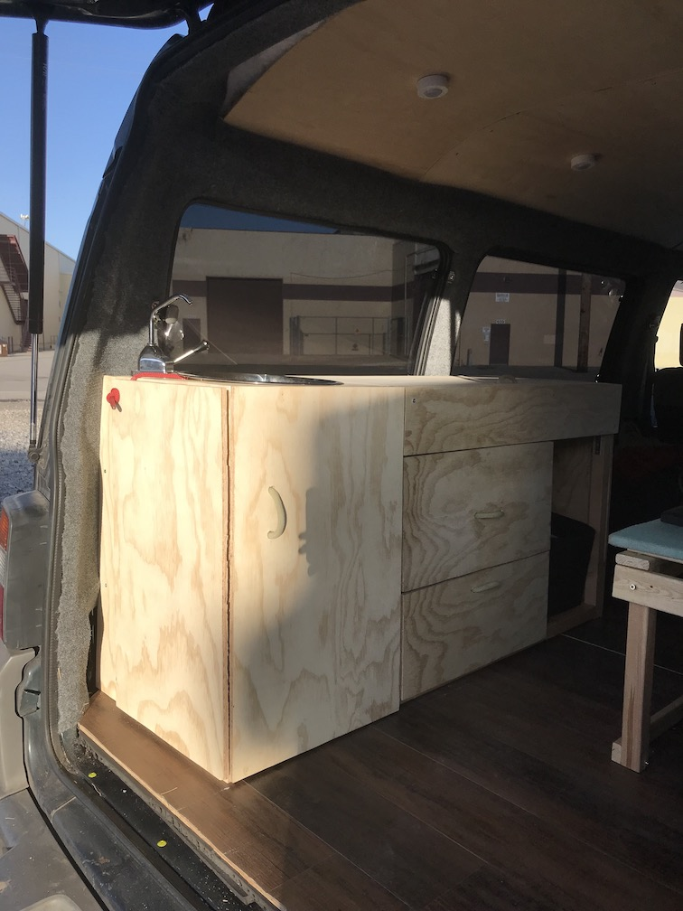
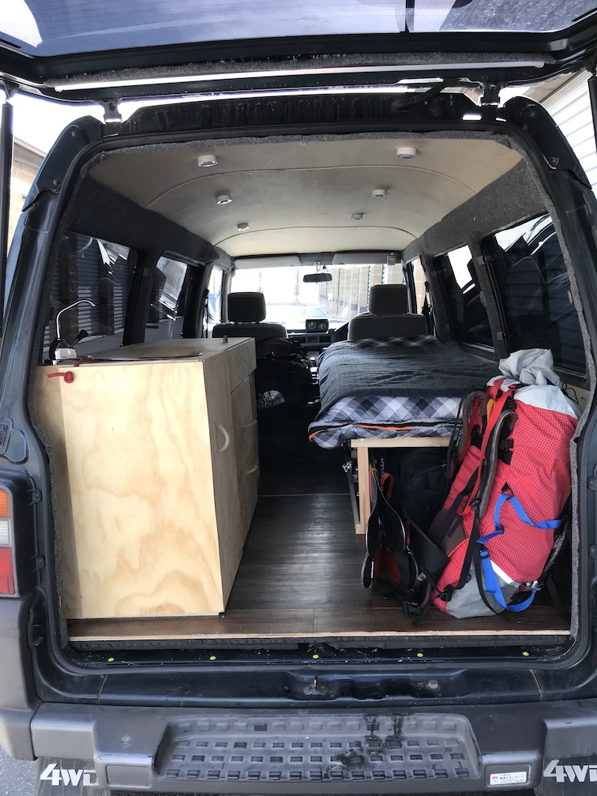
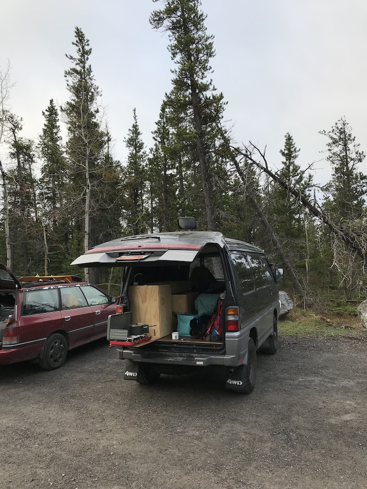

##Changes

It's go time! I'm currently driving from Salt Lake, Utah to Talkeetna, Alaska to climb. A month ago, I was planning to fly. Why not just do that? It's certainly simpler and cheaper.

As Forest and I hiked out of the Bridger Jacks after our seven-tower weekend, he asked if I was driving to Alaska. I realized I hadn't really given it fair consideration. Then I realized driving would let me climb in Canada too. Then I remembered I hadn't done much work on Totoro (the van) since November. The seed was planted and within a few days I was planning the van build-out and my timeline.

I had also been thinking loosely about finding a partner to stay in Alaska after my first climb and do Denali. I put some feelers out but knew no one needing a partner. Denali permits have to be issued 60 days in advance OR one person can be added 30 days in advance. I checked Mountain Project's partner finder ~40 days before my end date, thinking someone might have posted wanting to add someone to their trip. Just three hours earlier, Peter left a message about his partner being injured and hoping to salvage a [Cassin](https://www.youtube.com/watch?v=1dCxQEcHjls) trip. Perfect! Turns out we know a lot of the same people from Nepal trips and felt like we'd work well for the Cassin. Two weeks later, we were climbing Pfeifferhorn and Lone Peak to prep.

The last month has been a whirlwind...

##Training

My training continued with a transition to focus on muscular endurance close to the climb. My aerobic threshold has not changed since March, but my pace and ability to carry weight have. Humping 60lbs of water up 2500ft in an hour is now my benchmark for later training.

##Totoro

The key to my 3000 mile journey to Alaska was a functioning vehicle. Many great ideas and nice-to-haves had to be deprioritized to "post-AK". At this point, Totoro was a shell. He had a floor and insulation but no wall or ceiling coverings, no bed, no storage, no lighting, and no water system. I had ~14 days to work on him, split by a trip to New York to see my sister.

The wall upholstery in standard grey carpet came first. The ceiling panels, made of 1/8" thick birch plywood, got sandwiched between two upper rails and bent to shape. Shoving panels just barely small enough to bend into place took a good bit of grunting. Wall panels went up the next day, followed by the bed. 

The passenger-side cabinets, meant to house food, stove, and sink, challenged me the most. I framed them out in 2x2s, then faced everything with 1/2"-3/4" ply - cut with a jigsaw... Why I ever thought that was a good idea, I don't know, but I perservered without a table saw, just a steady hand and a square. I cannot recommend trying to get a drawer to fit sliders properly with jigsawed pieces. It forced everything more square but nearly killed me (and did kill one set of drawer slides). Finally, the drawer slid, the cabinets opened, everything shut tightly with magnet catches, the faucet and sink fit, and the rear fold-out table supported weight.

I left space open to decide how to build out the last cabinet and chose not to build a bed extension (sorry ladies) in the interest of time. Hit me up with ideas, if this inspires you to think about van builds.

Oh, and all of this was done in a Lowe's parking lot or down by the train tracks. I met a lot of interesting and nosy people...

##Canada to Alaska

A few duffle bags, two pairs of skis, tent, climbing packs, kitchen supplies, stove, food, and water filled Totoro to his comfortable limit. Oil freshly changed, we set off for the Canadian Rockies, by way of Helena and Calgary, hoping to climb alpine ice and mixed routes. I sit in the Canmore Public Library, so far unsuccessful with the soggy, warm weather, but hopeful of tomorrow's prospects. The next week will see me along the Alaska Highway through upper British Columbia and lower Yukon Territory. I expect amazing scenery, rigorous fuel monitoring, and no mosquitoes(!).

*#vanlife*

I plan to fly onto the Kahiltna Glacier on May 20 for five weeks of smelly expedition life. Here's to safe climbing and a weather window or two!