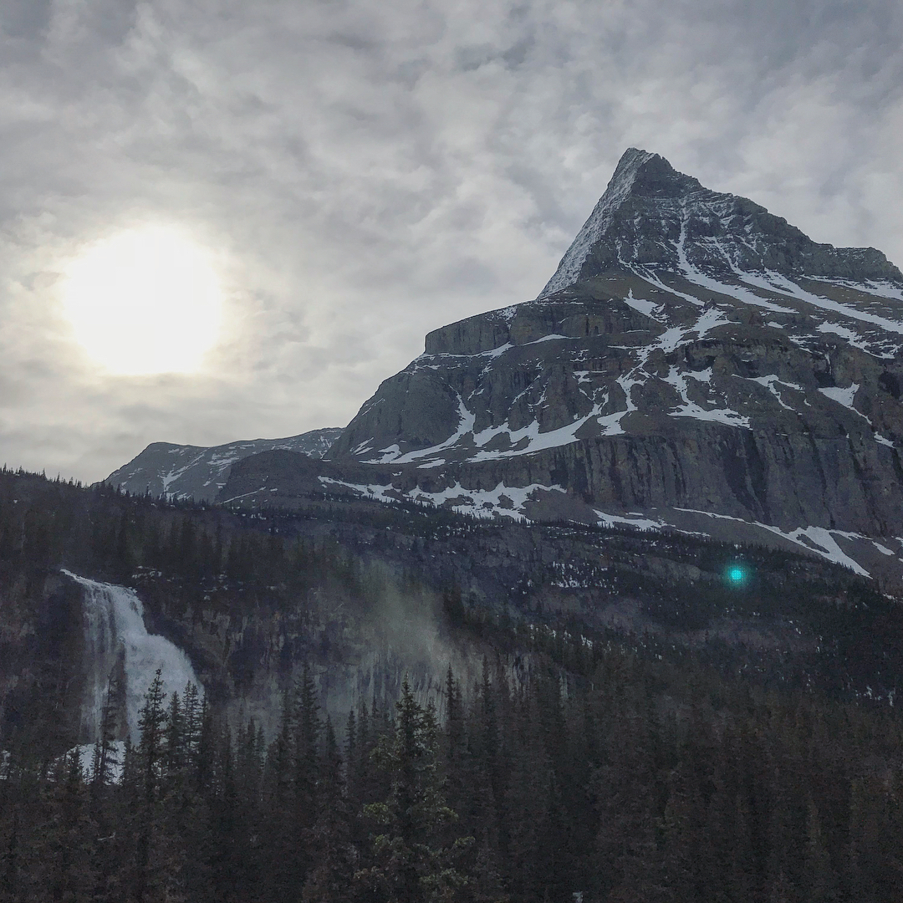
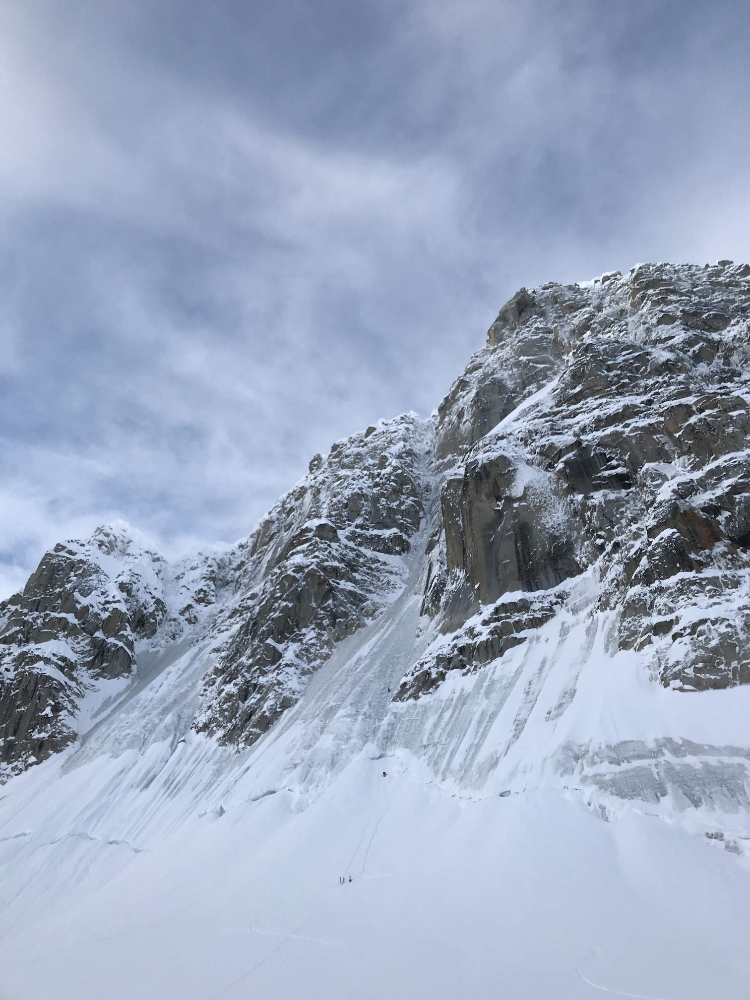
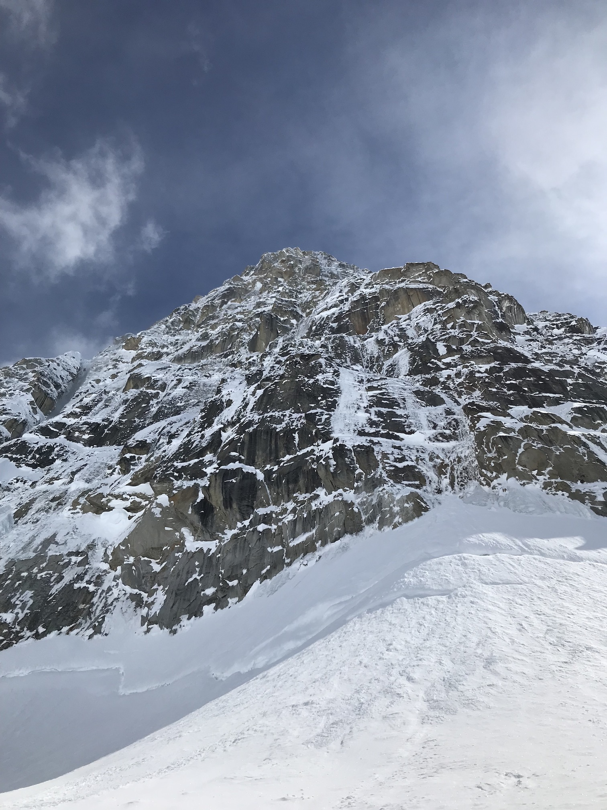
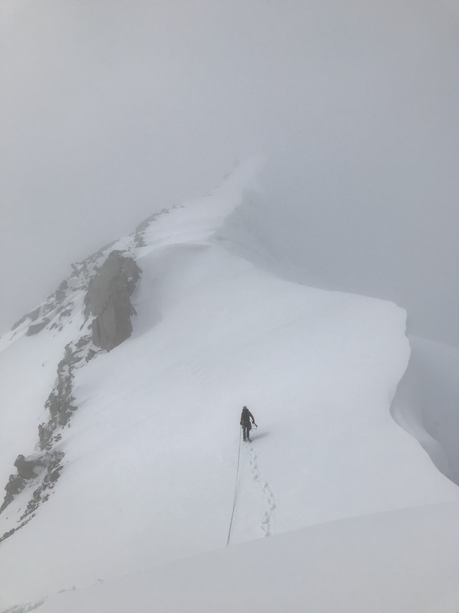

##Getting There

I never ended up climbing in the Canadian Rockies. Mist dampened rock climbing at Yamnuska and warm temps threatened any Athabasca route. A hike up near Berg Lake at Mt. Robson kept me (partly) sane through the thousands of miles of boreal forest to Anchorage. That and all the wildlife.

*Mt. Robson in early morning light*

I picked up Ryan at the Anchorage airport, made a Walmart stop to get a "close enough" pile of food, then bee-lined it to Talkeetna. At the air taxi that would fly us onto the glacier, we spent a few hours packing, re-packing, and weighing our bags. Checking in, we were told only three days in the last month had been good for flying. One of Ryan's friends had spent a week in Talkeetna, then returned home without ever flying. Somehow, the next day, when we had planned months ago to fly, the skies opened and we took our seats on a four-seat bush plane to Kahiltna Base Camp.

##On the Glacier

We settled into basecamp that first day, digging out the tent platform and kitchen pit, and inheriting a bathroom pit. The hole melted into the snow from weeks of urination seemed bottomless. We wondered aloud how far it went down. 10 feet? 100? To the bedrock? Luckily climbing kept us busy enough that we never tried to find out...

On the morning of our first full day, we headed for the Mini Moonflower, a long, moderate ice route named after our main objective (the [Bibler-Klewin](https://www.mountainproject.com/route/108486270/the-moonflower-buttress-biblerklewin) route on Begguya's North Buttress is also known as the Moonflower). Our start was not early enough and another party had scooped us. Nevertheless, we decided to follow them through the traversing (and therefore safe) first pitches. As the route choked down and icefall became more of a threat, we eyed the other party closely as they led the crux. I wondered why they were going so slow. It seemed like the leader had almost stopped. What is he doing? 

*Just too late on Mini Moonflower*

Ryan pushed the belay into the narrowing gully and I started to lead up. This proved one pitch too far, as ice chunks rained down, Ryan taking one particularly painful one to the shin. I got to the closest protected belay, Ryan came up as quick as he could, and we started to rappel. 

Back in basecamp, we met the Québécois team. One of them *had* stopped on the crux pitch; the leader hung off a screw and took a shit... We also learned this is not his first lead shit (or second)... Tabernac!

Mt. Frances rises right out of basecamp. The skyline follows a mixed and snow ridge to a massive cornice hiding the remaining traverse to the true summit. With one rest day and a solid forecast, Ryan and I climbed the ridgeline for my first Alaskan summit! The climbing felt moderate and got us warmed up for something bigger.

##The North Buttress is Big

Even from the plane, the North Buttress of Begguya looked off. It was much snowier than the photos I remembered and no one had climbed it this year. Ignoring the uncertainty, we packed for a four-day trip up the buttress and set off on the Mugs Start, a variation on the right side.

*The 4000-foot-tall North Buttress*

Good ice led through the first rock band, followed by a rope-length snow traverse (no gear) and mixed climing up a gully (reasonable gear) to a less-than-ideal anchor. Much of the rock was covered by sugar snow, secure enough if you could compress it into a step but useless at depths less than a foot. Ryan started up an insecure and poorly protected rock step, but came down after extensive digging with a loose ice tool pick. I thought it would go and spent probably half an hour digging, climbing up and down, and finally placing good pro. After that section, I got one slung horn, backed up by a picket, and one terrible screw in the next 60-65 meters of sugar snow, névé, and slabby granite. As Ryan followed the pitch, our half-ass repair job on his pick failed. Knowing the conditions were terrible and Ryan would have only one good tool, we bailed.

Les Québécois tried the buttress the next day. We wandered out to get our cache of gear at the base, arriving just as they were at our high point. I found a mitt they had dropped, then a belay jacket that we would later learn was a gift from a girlfriend came floating down the face and stopped just above the bergschrund. We shouted up where it stopped and drew an arrow in the snow. In the end, they had a shittier time than we did - they tried the original start and couldn't get over the bergschrund, they tried multiple paths and couldn't get above our last anchor, the jacket fell into the bergschrund after it collapsed, and that was their last climb before having to fly home.

Unlike them, Ryan had until the end of the week and the forecast showed two good days. We figured the West Ridge of Begguya might go before the bad weather if we pushed hard. Turns out the same snow conditions on the buttress prevailed on the ridge, making progress through the rock band slow and frustratingly insecure. Our choice to bring one sleeping bag as a quilt left us with (literal) cold feet. Unsettled weather dropped four inches of snow every day. I set off a twenty-foot-wide (harmless) wind slab avalanche and later fell into a crevasse up to my armpits. Mid-afternoon on day two brought us near the summit plateau. With the forecast for worsening storm and low visibility, we were not going to navigate the broad, crevassed summit plateau successfully in time. I told Ryan I thought we should go down and he agreed. After reversing the whole ridge in the same low viz conditions and returning to camp, the mountain started to clear. The next day was bluebird and we had to remind ourselves that we made the best decision with the information we had.

*Descending the West Ridge with relatively good visibility*

My partner for the second half of my trip, Peter, was waiting in basecamp when we returned. Ryan flew out the following morning to return to work and scheme for his return to the Alaska Range. Despite only one summit, I think we pushed every climb as close to the edge as we could have - Mini Moonflower a little over the edge - and can be satisfied with our abilities never being the limit.
