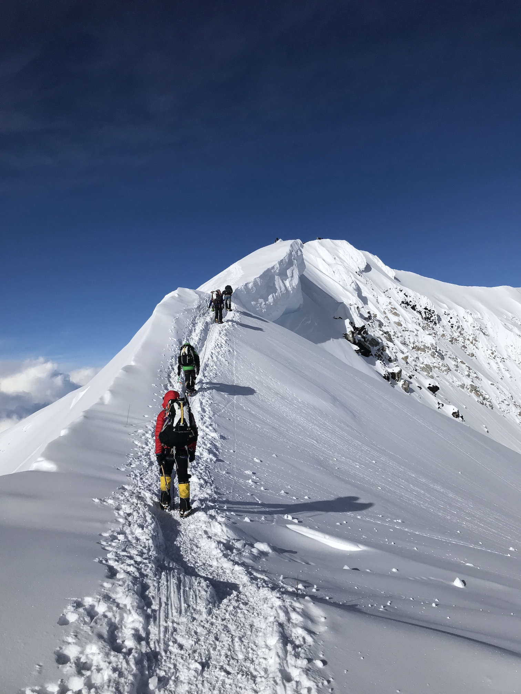
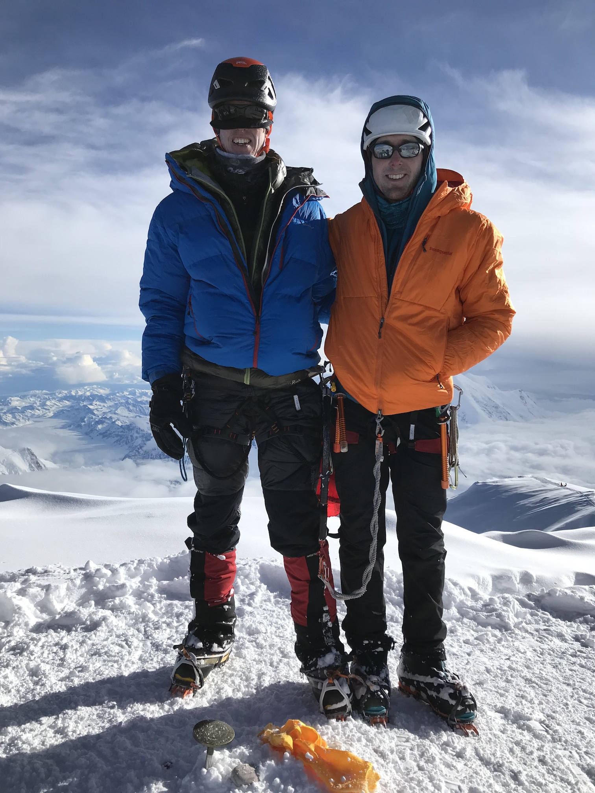
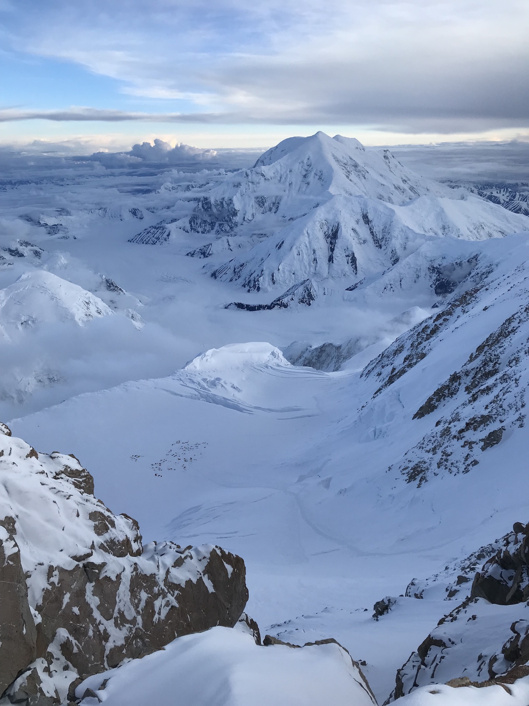
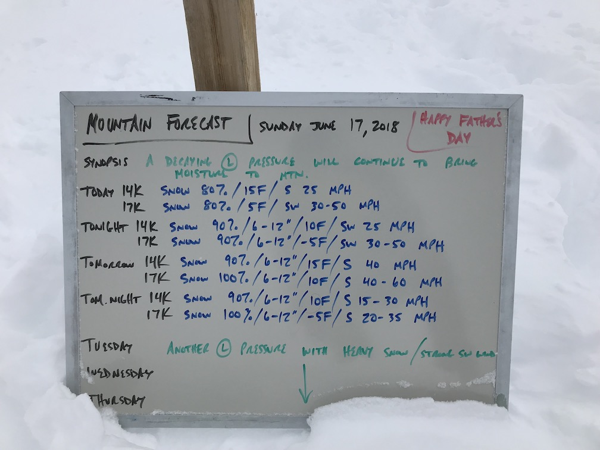

[Part 1 - Ryan and Begguya](/alaska-part-1/)

##Sleds

I must start this chapter of my Alaska adventures with a reflection on pulling sleds. I was so changed by the experience that I wrote this poem. I hope it gives you insight into the joys of getting from basecamp to 14k camp on Denali.

<h3 style="text-align: center">Fuck You Sled</h4>

Fuck you sled   
Eat a bag of dicks   
You're as heavy as a sack of black holes that traded their souls to Newton to break the laws of gravity

Fuck you sled   
I'm tired of your shit   
You're somehow both limp and stiff like the half chub of a middle-aged man out of Viagra

Fuck you sled   
Shit! Bitch! Goddamn whore!   
You're rolling faster than an FBI informant on Molly

Fuck you sled   
I won't drag you anymore   
You're going to kill me

Wait, I have to drag this sled <em>down</em> too?!   
Fuck you sled

##Weather

The weather had been quite mild on the first half of my trip and got even better as we moved up Denali. Peter worried that we would run out of good weather when it mattered. In his five trips to Alaska, this time in early June was the best and longest window he'd ever seen.

We arrived at 14k camp with all of our crap in four days, scouted to 16k feet after a rest day, and decided to climb the upper West Rib on June 8. The going was slow with eight inches of new snow from a quick storm and our limited acclimatization. I broke trail most of the day to the Football Field, a flat area at 19,500 feet. Peter mentioned feeling out of it from the altitude but wanted to continue to the summit. He pushed through and we stood on the crowded, windless top of North America. 

*The final ridge to the summit*

*Not too cold up here*

The standard West Buttress route was impossible to miss for our descent, with wands every hundred feet and the tracks of hundreds of previous summitters. We skipped around guided parties as we approached 17k camp, then had the ridge to the fixed lines to ourselves. 16 hours after starting, we were back in our tent, gorging on Gatorade before bed.

*14k camp from 17k ridge*

Our first real storm hit the next day. Two feet of snow fell and 30 mph winds whipped through 14k camp. I got my first taste of shitting in a CMC in a storm - a rude awakening after Himalayan toilet tents (a CMC, or clean mountain can, is a bucket distributed by the National Park Service, lined with a compostable plastic bag you shit in). Luckily we only had to dig out the tent and toilet hole twice a day.

The forecast looked promising with a three-to-four-day window before a big storm. We coordinated with the two other groups looking to climb the Cassin and packed to get on route. But forecasts are lies in the Alaska range - not intentionally wrong but largely unreliable. On "sunny" Tuesday, we awoke shrouded in clouds and hearing the tinkling of light snow on the tent fly. Not going to start today...

##Exercise

Wednesday, however, had decreasing winds and we could see the sun. A few groups started up the West Buttress mid-morning, breaking trail in knee-deep powder. I wanted some exercise before more days in a tent, so I followed up at noon. Stuck behind guided parties in a crevassed section, I couldn't move as fast as I wanted to but soon was able to pass and catch the lead party on the fixed lines. At the start of the ridge, I passed them, cruising up the moderate névé to 17k by 2:30. 17k camp was empty and I didn't see any tracks higher on the mountain. Reaching Denali Pass, I could feel the altitude slowing my steps. One breath per step carried me to the Football Field, protected from the west wind. I enjoyed the calm for a moment, broken near the summit ridge as it poked into the gale. Mitts went on, face got covered, and the thought to go down flashed across my mind. "No, I can handle this." 30-40mph winds blew consistently until I stepped up to the summit at 6pm. I took in the views, alone for 3000 vertical feet and two miles in every direction.

<video style="max-width: 100%" playsinline="" poster="https://instagram.fyyc5-1.fna.fbcdn.net/vp/f0afd08311bc9518c86531b8a39f8341/5B33F3DF/t51.2885-15/e15/36085925_1005303252966374_2827688480639811584_n.jpg" preload="none" src="blob:https://www.instagram.com/a5390b2a-351b-474a-86d0-c8e1ba665f05" type="video/mp4"></video>

##No Exercise

Two and a half hours after leaving the summit, Peter greeted me and nicely started cooking me dinner. So began tent-bound life for the next five days and the slow dissolution of our psych. Three-plus feet of snow. 100mph summit winds and 50 at 14k. Only a Japanese language-learning book and episodes of the Enormocast for entertainment. An hour-long, need-to-shit-motivated lost-CMC digging session. Frozen, wet balls. And forecasts that deterioriated every day. These are a few of my least favorite things.

*That arrow points to forever*

As Peter's wife neared Talkeetna in the van, we reached an inflection point. Decide to climb or go down. Peter asked how long I'd stay if I were alone; I said I could handle two more weeks. I tried to find any reason to stay in the week-out forecast though. Continued low pressure meant imperfect windows and made climbing a committing route too dangerous a proposition. "I dragged that damn sled up here and I don't want to come back." Maybe I'll forget the pain and return for the Cassin...

##What's Next?

I've done my quota of tent-sitting and hiking for the year. I'm resolved to climb and climb hard. Look out for sport climbing(!), projecting(!), hangboarding(!), Teton speed-runs, Creek dirtbagging, weighted ice tool hangs, and hard ice.

##Post Script

During our great weather window, Colin Haley soloed the Cassin in 8:07, six and a half hours faster than the previous speed record. [Check out his post about that ascent here.](https://www.instagram.com/p/Bjx_asMnHCq/?taken-by=colinhaley1)