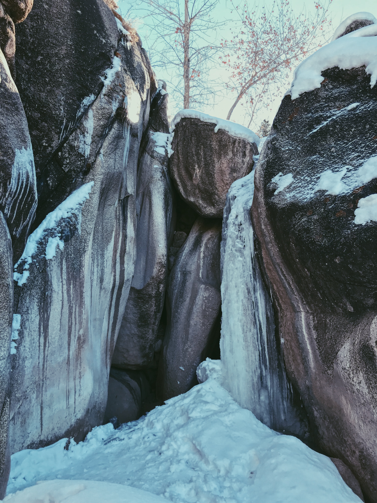
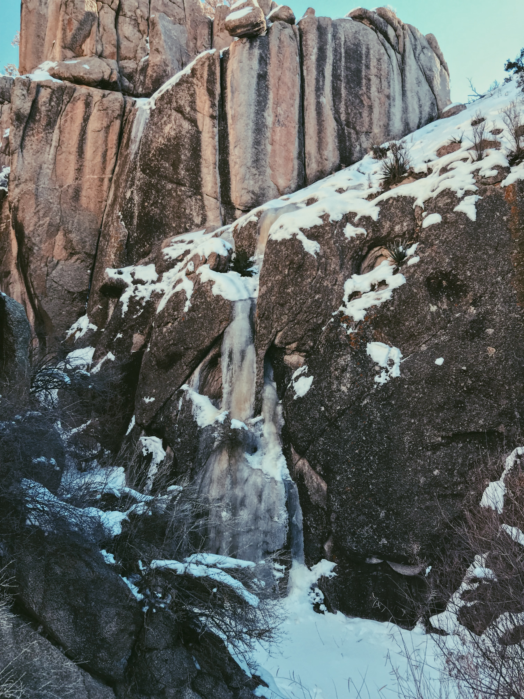

##The Inspiration
Everyone has to do a 30th birthday challenge of some sort or another. When it came that time for me, I considered thirty pitches in a day.

I figured there was enough new rock and ice to support the project, even in the "climbed-out" West accessible from Salt Lake.

##Project Criteria
- Complete thirty new routes before my 31st birthday
- Technical climbing (at least WI3, M3, 5th class)
- Ideally trad, multi-pitch, alpine, and free
- Lots of ice, since I love ice climbing

##New Mexico Ice
The first place I thought to search for unclimbed ice was New Mexico. It borders Colorado, there's very little documented ice, and people generally think it's too warm.

*[Ojo Sarco WI3](https://www.mountainproject.com/route/116361497/ojo-sarco)*

*[Ojo Sagrado WI3+](https://www.mountainproject.com/route/116361515/ojo-sagrado)*