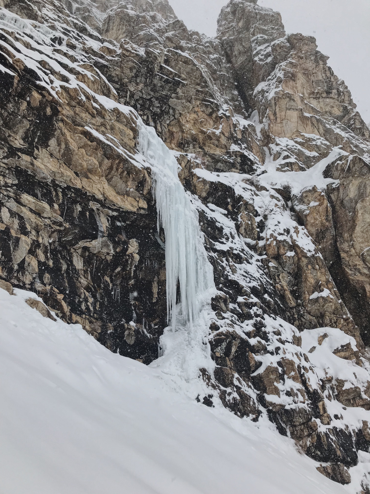
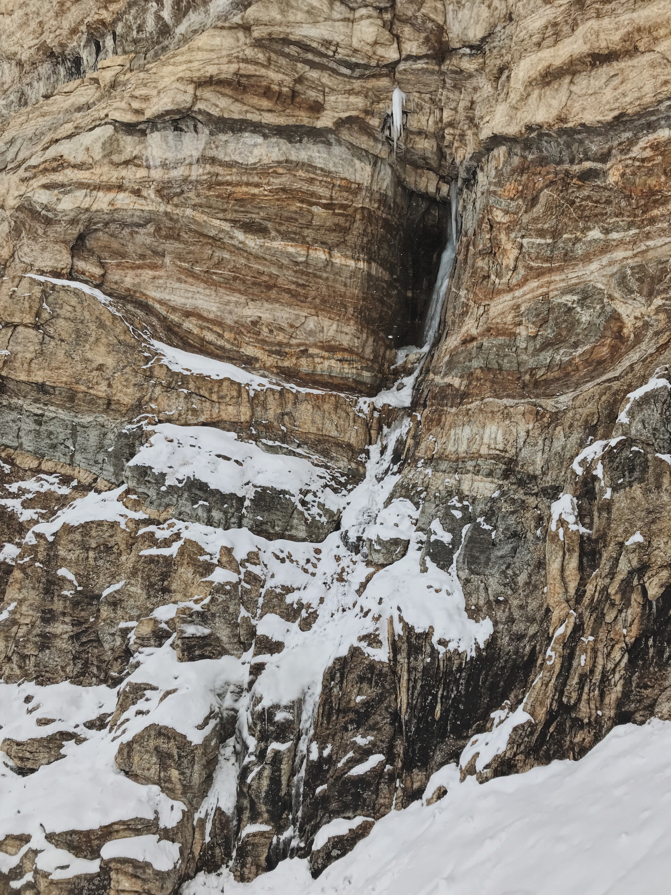

##Zion Exploration
On my way back from New Mexico in January, I visited Zion National Park for the first time as an adult. All I did was drive through the park from east to west, but it was breathtaking. I was kicking myself for not trying earlier to rock climb there, let alone get on the giant ice routes I'd read about. A month later, it was time to get serious about exploring the icy slot canyons.

I convinced my friend Julia to join me trudging around the Zion backcountry with binoculars. Apart from a potential climb that was out of condition and a deep tiredness from snowshoeing miles and miles, we came out empty-handed. Another short exploratory mission with another partner (Ryan) was the same. But we did manage to bag a couple monsters.

*Zicicle photo here*
*Nuclear Sunrise photo here*

##Secrets
Throughout my exploration of Zion, I noticed posts on Instagram of ice with familiar sandstone walls but intentionally no details.

Why do we keep climbs and climbing areas secret?

####Valid Reasons
1) *Letting others know prematurely could hurt the area's ethic* - The argument goes that controlling early access prevents people from changing .

Why is your ethic so fragile? Why won't people respect it? 

####Morally Ambiguous Reasons
1) *Preventing random people from trespassing and souring relationships with landowners* - The problem is... you're already trespassing...

####Bullshit Reasons
1) *Keeping your personal crag free from outsiders* - You deserve a personal crag on public land?
2) *The area is sensitive and can't handle the traffic* - Being secretive avoids addressing the root cause. If the area has the potential to attract high traffic but is sensitive in some way, an actual land management plan needs to be put in place with the landowner. No worthy area stays secret forever.

##Nevada Ice

When I started skinning up Lamoille Canyon the first time, I didn't know what exactly to expect. A few sites mentioned ice but with no specifics. I didn't even realize there was a guidebook and that it had (one page!! of) ice climbs listed until I reached out to the guidebook author. So when I saw six ice climbs in the first four miles, I was ecstatic. 

*[White Lines WI4](https://www.mountainproject.com/route/116596279/white-lines)*

*[Fight Me Like a Real Man WI3](https://www.mountainproject.com/route/116596315/fight-me-like-a-real-man)*

*On the FA of Fight Me Like a Real Man*

*[David is a Little Bitch WI3+](https://www.mountainproject.com/route/116596351/david-is-a-little-bitch)*

*[Who Uses A Slingshot Anyway WI4](https://www.mountainproject.com/route/116596344/who-uses-a-slingshot-anyway)*

*[#1s All the Way WI3 M3](https://www.mountainproject.com/route/116596407/1s-all-the-way)*

*Julia descending after a good day's work*