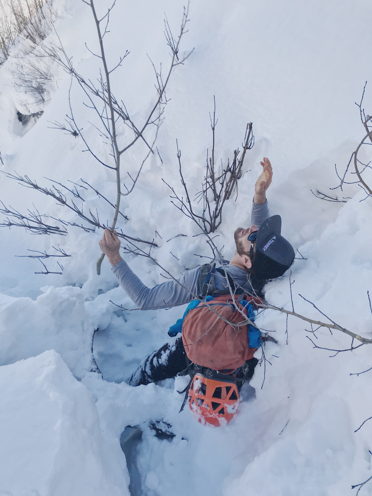
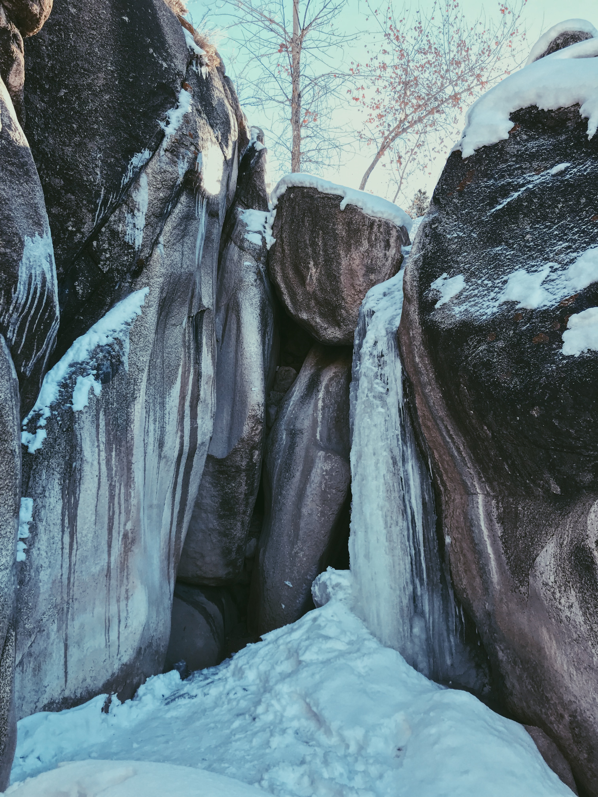

##The Inspiration
Everyone has to do a 30th birthday challenge of some sort or another. When it came that time for me, I considered thirty pitches in a day, but I had also been looking for a way to focus next year's climbing. Why not do thirty first ascents as my birthday challenge?

First ascents hold a special place in climbing history. Every guidebook lists the first ascentionists and the date of the first ascent alongside more practical information like the grade and length. But where does the value of a first ascent lie? Is it in being the first person to have the ability to climb the route? Some push grades with new routes, but Epinephrine was put up long after the first 5.9. Does it come from the adventurousness of the first ascensionist, deciding to explore where others have not? Plenty of ice climbs exist only in the right season but in well traveled areas. Maybe it is as much the dedication combined with the vision and the skill to produce a new climb? But does that mean an easy first ascent isn't valuable?

Today, the first ascent via exploration becomes harder and harder. The world grows smaller as more and more people have the means to access remote areas. The first ascent via skill follows a similar progression. The range of climbs too-hard-for-most-but-still-climbable-by-one squeezes into a vanishing space like improvements on the hundred meter dash.

So why chase first ascents at all when they are increasingly difficult and of dubious extrinsic value? Because when I see a new climb I feel giddy. When I'm approaching for hours I don't question it. The smallest slice of adventure, an objectively unimportant climb, still makes my heart fill my chest and my teeth try to escape my face.

This challenge is as much about identifying and maximizing those qualities in climbing that feed *me* the most as it is about climbing something never done before. I'm finding that there are qualities in exploration that you just can't get from another trip to the Creek. A first ascent is like an onsight on steroids. It tests your ability to decipher the grade, cruxes, rests, length, and line from a distance. Add to that the unknown of whether the climb exists at all and you have a set of puzzles that engage my mind and body in equal measure.

##Project Criteria
- Complete thirty new routes before my 31st birthday
- Technical climbing (at least WI3, M3, and/or 5th class)
- Ideally trad, multi-pitch, alpine, and free
- Lots of ice, since I love ice climbing

##New Mexico Ice
The first place I thought to search for unclimbed ice was New Mexico. It borders Colorado, there's very little documented ice, and people generally think it's too warm. Plus I had a good friend, Forest, in Los Alamos with a home base for exploration.

I started research with a waterfall guide to New Mexico, since I knew of someone successfully using it to find new ice. Marking promising areas and features on Google Maps, I plotted a few loops from Los Alamos for scouting. After deciding the weather had been cold and snowy enough, ten hours' drive from Salt Lake put me in the atom town.

*Forest digging for FAs*

The first days didn't pan out; warmer temperatures or unplowed roads kept me from climbing. Forest and I went out one day and found plenty of deep snow. But I got luckier with a desert box canyon called the "Embudo Box". Photos showed a short waterfall with an easy approach and another farther in. On the drive in, I noted how much snow there was and how the temperature dropped. My first target, Ojo Sarco Falls, was frozen solid. 15 feet tall but climbable.

*[Ojo Sarco WI3](https://www.mountainproject.com/route/116361497/ojo-sarco)*

The second falls, Cañada del Agua, had almost no ice. I still have no idea why. There can be good signs for ice formation but enough variables that it is very fickle.

But farther up the Embudo Box canyon, at a point with no flowing water, I caught a glimpse of more ice! A large snowy slope melted enough in the afternoon sun to grow a thin smear. After a few moves on the inch-thick ice, I gained more solid terrain, stacking tool sticks vertically on the body-width section. This felt much more like real ice climbing.

*[Ojo Sagrado WI3+](https://www.mountainproject.com/route/116361515/ojo-sagrado)*

With two FAs and another area with great potential scouted by the second week of January, I was ahead of schedule. But it would be over a month before I would add to my total.