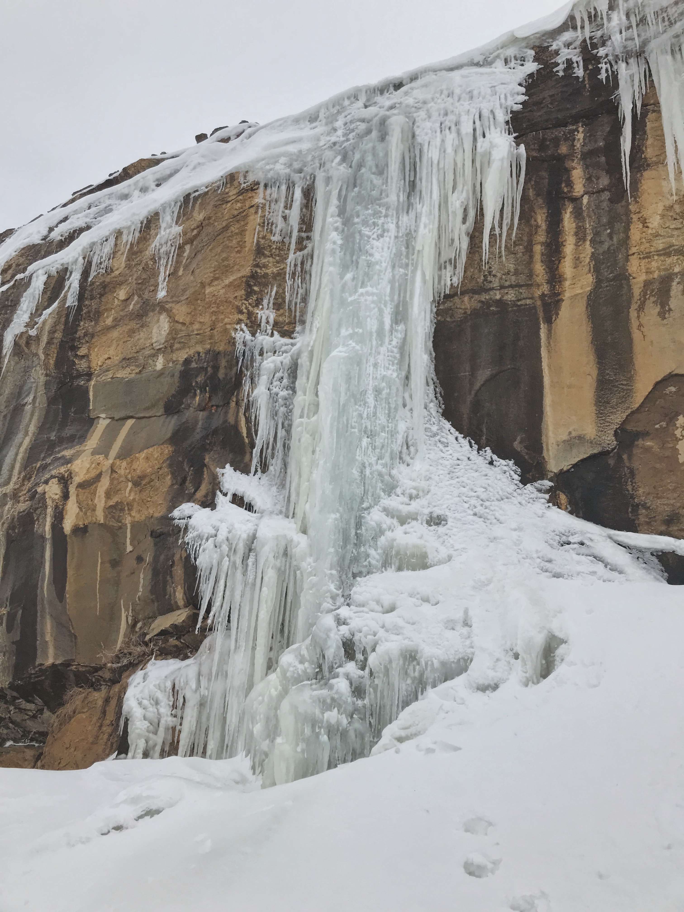
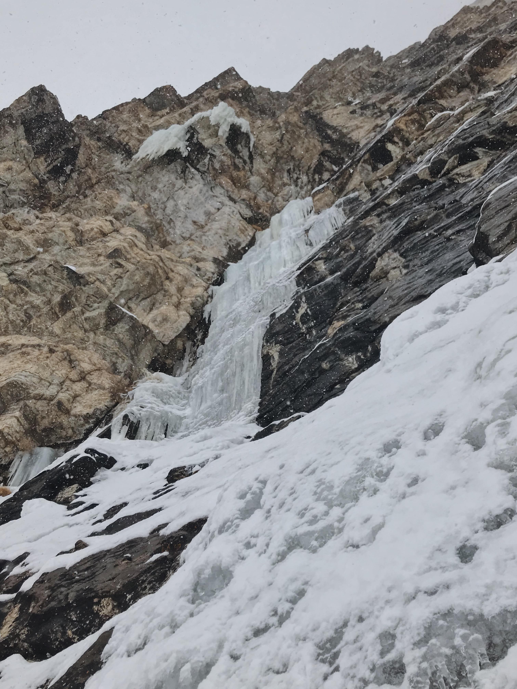

##Zion Exploration
On my way back from New Mexico in January, I visited Zion National Park for the first time as an adult. All I did was drive through the park from east to west, but it was breathtaking. I was kicking myself for not trying earlier to rock climb there, let alone get on the giant ice routes I'd read about. A month later, it was time to get serious about exploring the icy slot canyons.

I convinced my friend Julia to join me trudging around the Zion backcountry with binoculars. Apart from a potential climb that was out of condition and a deep tiredness from snowshoeing miles and miles, we came out empty-handed. Another short exploratory mission with another partner, Ryan, was the same. But we did manage to bag a couple monsters.

*The classic Zicicle WI5 240'*

*Desert ice is the best*

*Nuclear Sunrise WI5 400'+*

##Nevada Ice

When I started skinning up Lamoille Canyon the first time, I didn't know what exactly to expect. A few sites mentioned ice but with no specifics. I didn't even realize there was a guidebook and that it had (one page!! of) ice climbs listed until I reached out to the guidebook author. So when I saw six ice climbs in the first four miles, I was ecstatic. 

*[White Lines WI4](https://www.mountainproject.com/route/116596279/white-lines)*

I climbed White Lines on that first scouting trip and made notes on all the formations for a return. Unfortunately the sun came out for a few days and destroyed White Lines (nothing left but a wet streak) and a few other potential routes. But there was still plenty to do the following weekend, so I spent the first day hiking into an area I called Goliath's Tears after the Colossus wall nextdoor. 

*[Fight Me Like a Real Man WI3](https://www.mountainproject.com/route/116596315/fight-me-like-a-real-man)*

*On the FA of Fight Me Like a Real Man*

Three icicles awaited me in a small cirque 2000' above the road. Fight Me Like a Real Man was a little warmup that could hold a long streak of WI2 in drier conditions, David is a Little Bitch had fun climbing and was the prettiest, and Who Uses a Slingshot Anyway poured directly out of a corner low on the headwall.

*[David is a Little Bitch WI3+](https://www.mountainproject.com/route/116596351/david-is-a-little-bitch)*

*[Who Uses A Slingshot Anyway WI4](https://www.mountainproject.com/route/116596344/who-uses-a-slingshot-anyway)*

The following day Julia and I explored between two rock buttresses where I saw a cave route, which of course, reminded me of THE [Cave Route](https://www.mountainproject.com/route/105717361/cave-route) in Indian Creek. I was going to call it #1s All the Way even as a pure ice route, but it turned out to be mixed and would have taken two #1s if I had them! I made do with nuts and wrapping an ice column to get off.

*[#1s All the Way WI3 M3](https://www.mountainproject.com/route/116596407/1s-all-the-way)*

*Julia descending after a good day's work*

##30 FA Project Summary
I was at 7 out of 30 first ascents on March 3, 2019. I should expect to do 2.5 per month to be on track. The next deadline is 10 by April 25.