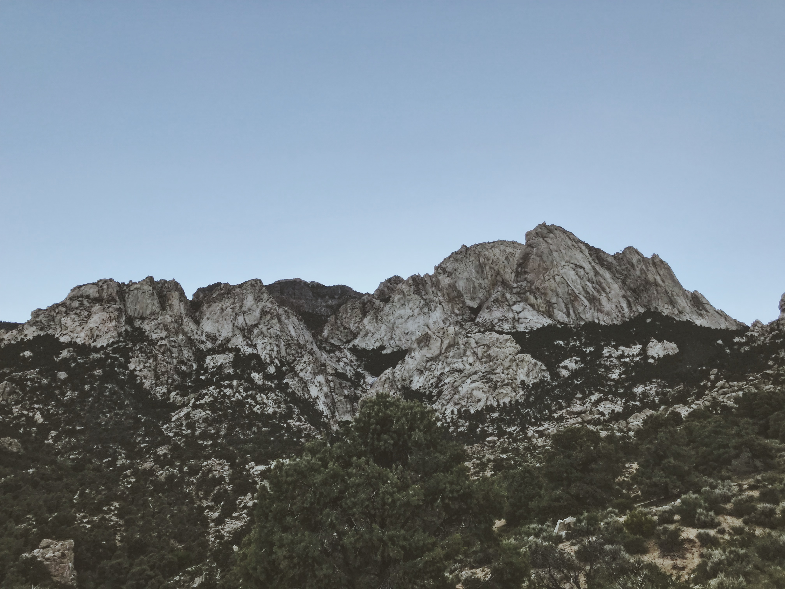
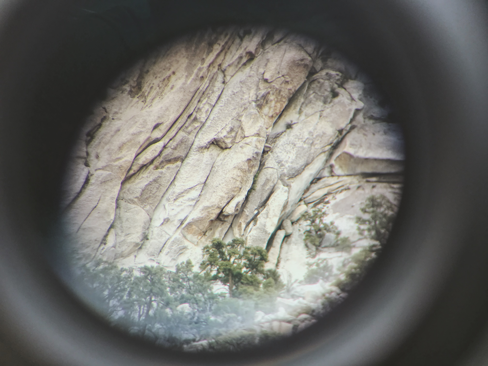
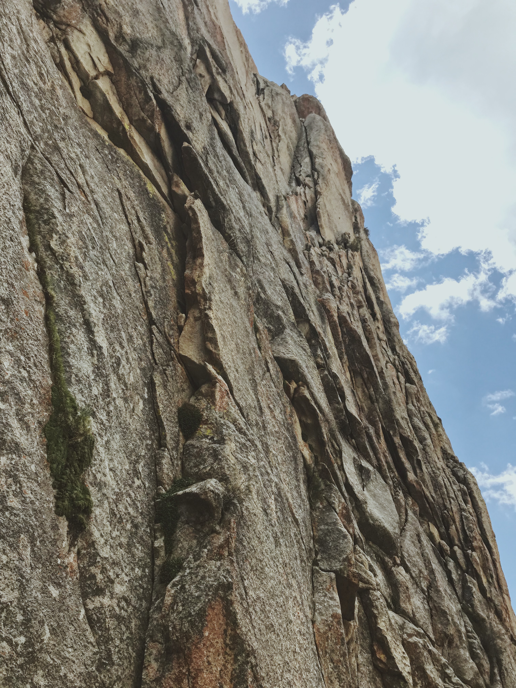
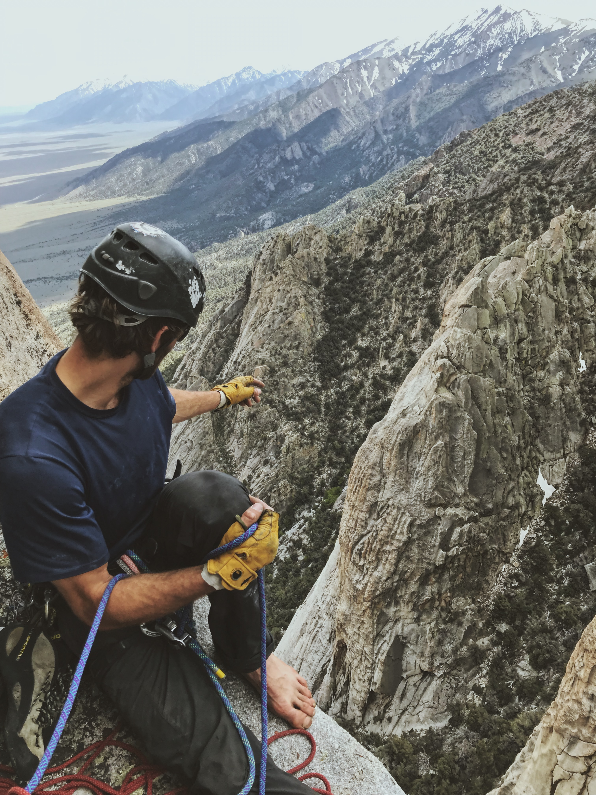
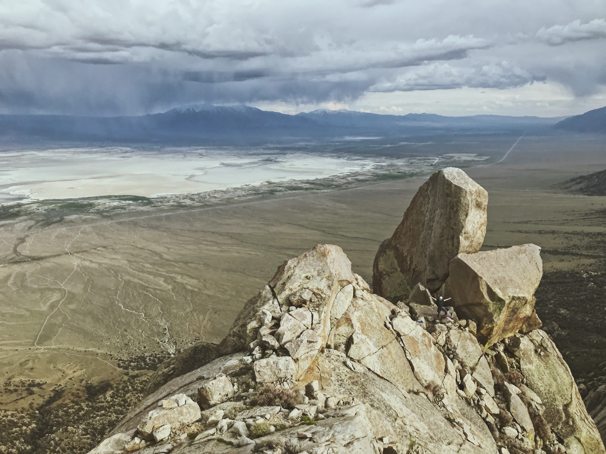
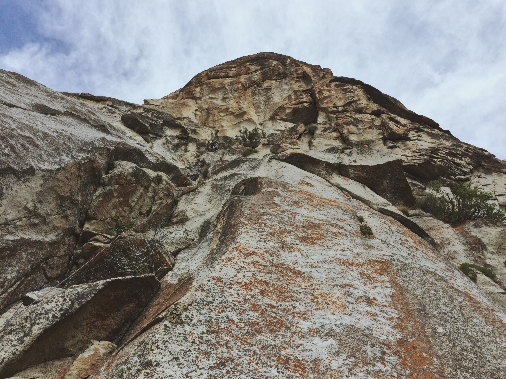
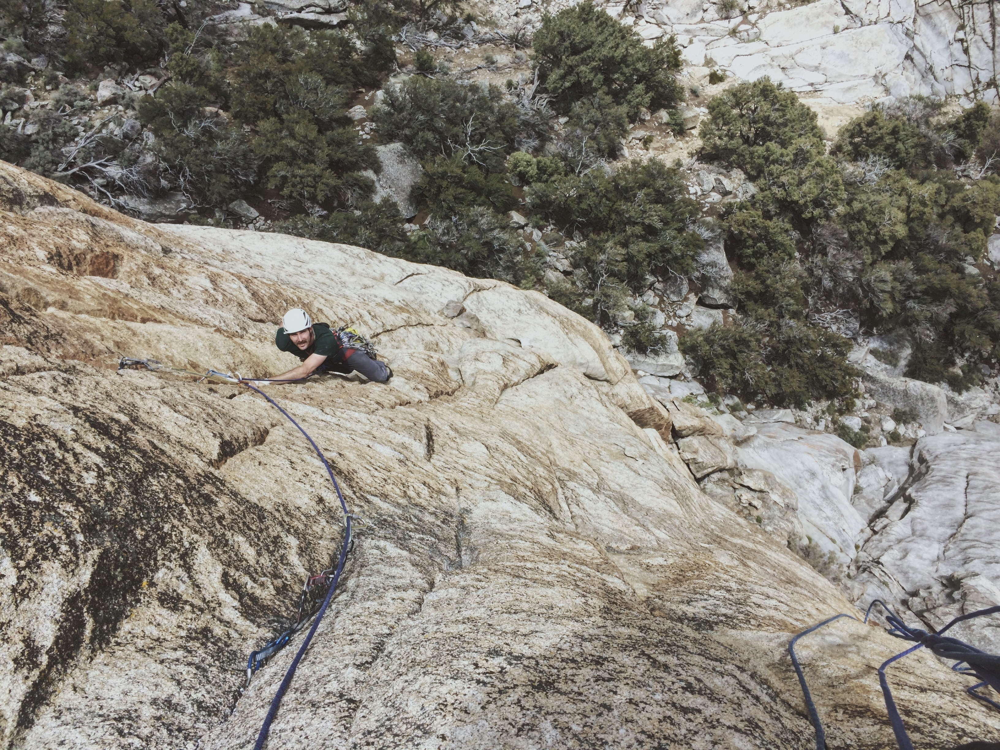
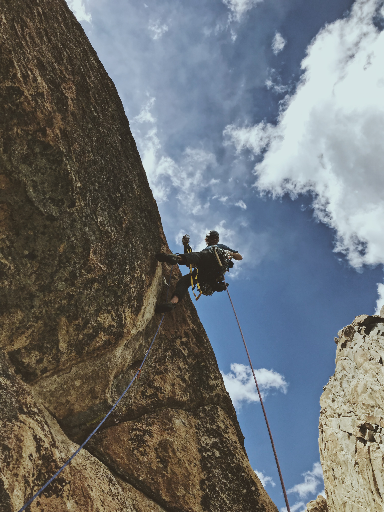
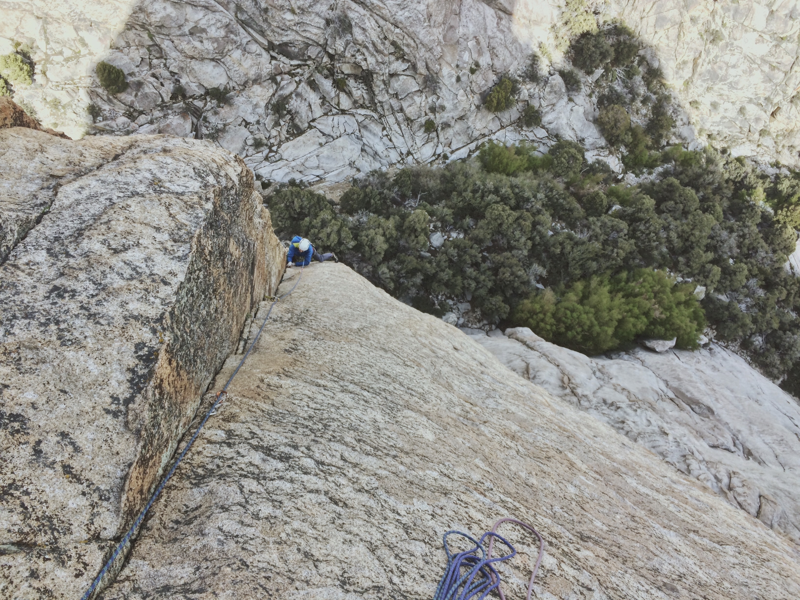

*Note: I will attempt to keep some wildness in the Wild Granites and only describe routes we did. Contact me if you want more info. Also given the lack of information about the area, all FAs listed are likely FAs but not certain. If you put up routes in this area and want to correct anything, just let me know.*

##Attempts

April's trip to New Mexico for new routing was unfortunately stymied by a road closure. However, we got a lot of exploration done elsewhere in the area and I cleaned up a full-rope-length 5.8 handcrack on TR. In May, I focused more on climbing hard in Indian Creek and trying more sport around St. George. I definitely got stronger but was still at 7 FAs just over a week ago. I had to get back at it.

##Wild Is Right

Earlier this year, looking for more Nevada ice, I found a series of domes on Google Maps. They had water flowing over them, so I dropped a pin, noted the rock potential too, and kept searching.

I wanted to meet Forest somewhere on his trip back from Yosemite to Salt Lake and these domes were only a small detour. In my research, I found a name - "Wild Granites" - and far more confused posts on Mountain Project asking for information than any details. With nothing more than that, we set out to explore some wild granite.

##Getting Our Feet Wet

There is no approach trail, the no-see-ums bite like hell, there are snakes everywhere, and it's not worth it, we were told. Everything but the last part was true.

*The Tooth and Mosquitoes in My Mouth*

I spied a couple single pitches before Forest arrived and we agreed they were good targets for day one. At the base, I realized there was another route hidden to the right that looked much better. A short slab led into a hands-and-stemming corner, which changed directions and pinched down halfway up. A tricky patina mantle led under the tooth, a hanging dagger on the upper slab. Above the tooth and a .2, I cleaned up the loose crystals before trusting my feet to slab dishes for ~25 feet to a block I slung.

*The Tooth, 5.8 220'*

Forest took his turn climbing the less-appealing squeeze chimney plus exfoliating slab. It climbed better than it looked with occasional feet on a dike and finishing moves between big huecos. But it would need a bunch more traffic to clean up. Whoever wants to help should get on Mosquitoes in My Mouth, 5.9 220'. There's a slung block anchor all ready for you.

##Ambition

*Rattlesnake Surprise, 5.11- 5p 500'*

Now that we'd proven there was good climbing, we set our sights on bigger walls. On day two, we found a corner we liked on the backside of the main formation. Forest led, and excavated, the approach pitch onsight, traversing three incipient cracks in a slab to set the belay at the base of the corner. I got the money pitch. It switched from chimneying to #4s to finger pods and stemming with feet in the #6 offwidth. It even had a thin seam groove 5.11- crux just before the anchor.

*Those are some good rocks*

Forest and I swapped leads up the somewhat wandery hand cracks and laybacks to the summit, while scouting tomorrow's project.

*No one around for miles*

##The Big One

Over the course of the route on day three, we both came to realize we had found something special. Forest's eye had picked out a line through a roof, up thin angling cracks to another roof, and into a left-facing corner high on the face. I was skeptical it would go free, but we gave it a shot and came up with what we think is a four-star route anywhere.

*Gold Dust from the base*

The first day rained on and off and we made our way up with a mix of free and aid. Pitch one climbed 5.9 and 10- cracks, then patina face features for the last third before the roof. Pitch two tackled a tight #1s roof, engaging face features and thin cracks, and the first crux, a tricky slab traverse. Forest and I did those moves entirely differently but both worked at 11 or 11+.

*Just before the P2 crux*

The real crux came in getting through the pitch three roof. On our first day, we just aided and pulled through on gear. On the second day, I knew I wasn't going to get it and Forest had a much better chance, so I resolved to support his redpoint. He went up and worked the moves, sussing out the best gear and holds up to the next anchor.

Lots of hanging around, trying different beta, five good burns, a couple good screams, a pulled pin, and maybe five hours later, we're both at the belay. I know Forest is frustrated, but on each go he's linking more and getting closer. Sixth try's the charm and he's above the crux. The rest of the pitch is still solid 5.11, but he floats it.

*Forest gets us up the crux roof on our first day*

I get three moves into the crux, pull out the first piece, and fall off. Another two moves and I fall off. I try the exit moves and miss the terrible left foot. I try them again and surprisingly make it through. Not bad with a pack on.

*Me following P3*

More 5.11/+ slabs in a corner greet us for pitch four, but we both get everything clean first go. We're going to be done before dark! I lead us up the easy but improbable slab moves next to an offwidth, into the offwidth, and just below the summit block. Two rappels and we're headed back to camp for some La Croix and chili mac.

##FAs in this Trip Report
8) The Tooth, 5.8 220'
9) Mosquitoes in My Mouth, 5.9 220'
10) Rattlesnake Surprise, 5.11- 5p 500'
11) Gold Dust, 5.12 5p 500', FFA Forest Altherr

##30 FA Project Summary
11 / 30 FAs on June 7, 2019. Next target is 15 by June 25.