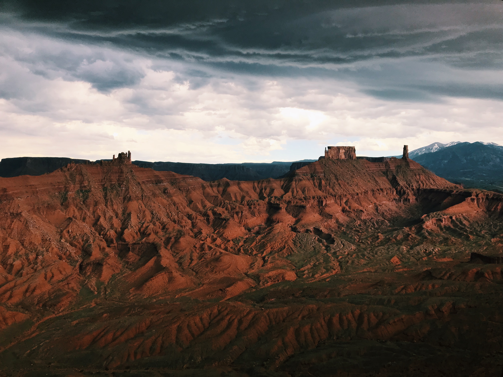
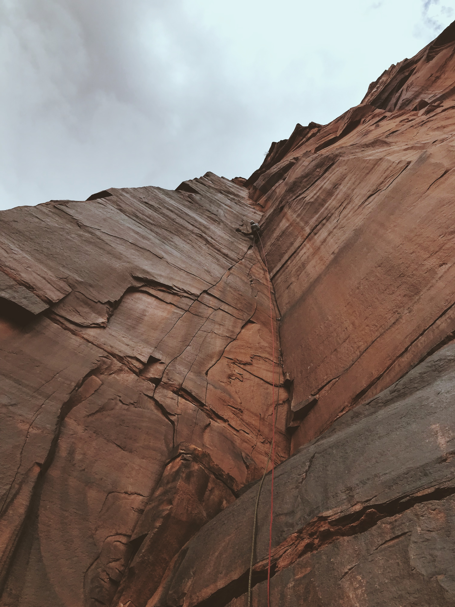
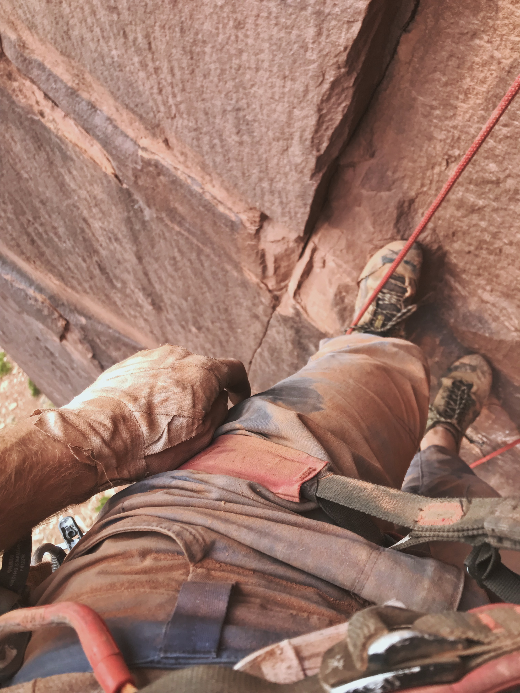
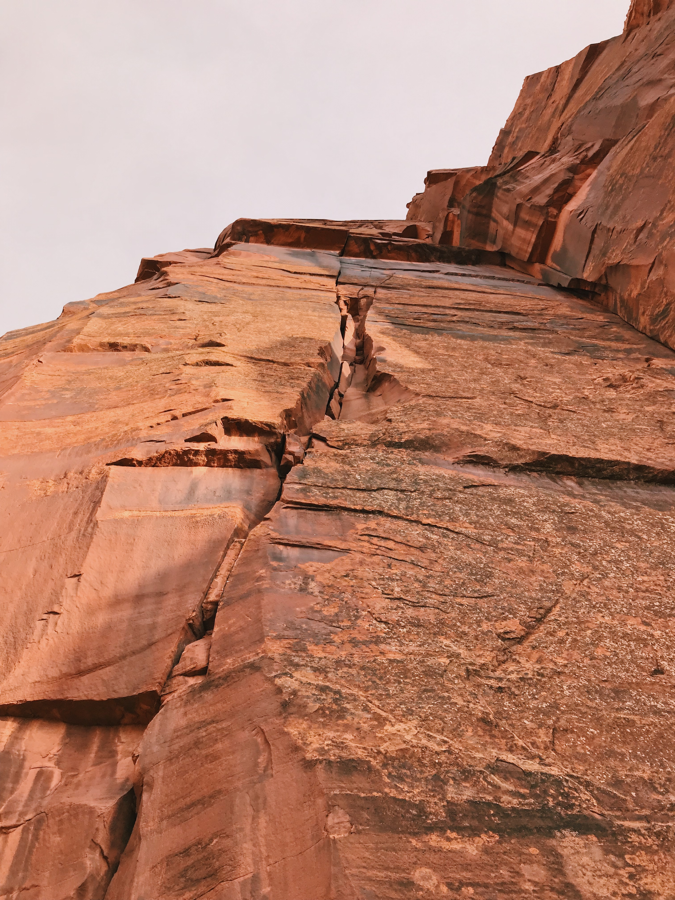

##The Deadline

June 25, the halfway point of my 30 FA Project, was quickly approaching and I was still playing catch up. Four routes in Nevada earlier in June had put me at eleven, but fifteen seemed far away. On Tuesday, I baked in a white-hot-granite oven to clean a 5.8 crack at an obscure crag in Little Cottonwood and make it to twelve. Then Levi suggested a trip to the desert... in June...

##The Cold Front

A weekend of cooler weather made a Castle Valley and Indian Creek trip a viable option. Despite some misgivings about wet rock, I couldn't say no to splitter cracks and a high of 70.

Friday's clouds made for some of the most atmospheric climbing I've ever done. Rain threatened but never came as rays of sunlight bathed everything in an eerie light.

*Gorgeous light in Castle Valley*

Access to the base of our new route required fixing a hand line across a particularly chossy and exposed ledge. Levi trundled a fine boulder, purely for safety reasons of course.

<iframe src="https://player.vimeo.com/video/344394380" width="640" height="1138" frameborder="0" allow="autoplay; fullscreen" allowfullscreen></iframe>

*The Trundle*

We made it up two pitches of splitter climbing before hail that looked like it was lit from underneath rolled down River Road. I fought through the one extremely muddy offwidth section then rappelled. The other 200 feet were clean off-fingers with just enough face features to place gear in the power lieback.

*[Monochrome Era](https://www.mountainproject.com/route/117268563/monochrome-era), currently two pitches at 5.11+ C2*

*Why is there so much sand in my eyes?*

We spent the next three days at the Cliffs of Insanity in Indian Creek, expecting to traverse to the far right side of the wall to find new climbs. Yet as we hiked up the approach trail, a splitter just to the left stood out to me and it didn't match anything on Mountain Project or the book. A couple minutes later at the base, there was another anchorless fingers corner, also with the potential for multiple pitches. We stopped to pinch ourselves; we weren't dreaming.

The first pitches of Ophidiophobia (the irrational fear of snakes) and ??? To Be Named went up the first day. Levi and I both got the corner clean first go, but Ophidiophobia had a sequence-y crux protected by a red ball nut that I had to try twice more to free. (Seriously, go do it. It's protected by a bolt now.)

*[Ophidiophobia](https://www.mountainproject.com/route/117268493/ophidiophobia), 5.11+/12- 2p, with [??? To Be Named](https://www.mountainproject.com/route/117268524) to the right*

The route name comes from a rattlesnake that showed up on Sunday. I heard a rattle walking along the trail and we kept an eye on him as we climbed. Unfortunately, we forgot about him as Levi was lowering me off and I landed a couple feet away to an immediate rattle and Levi's just-too-late "watch out for the snake". I jumped back immediately and swung out to safety. Sometimes a fear of snakes isn't so irrational...

Later on Sunday, Levi found a linkup of finger cracks just left of Funny Farm, probably 5.12+. It even has a gorgeous, yet-to-be-done second pitch in a stem box! How did we get so lucky?

Monday's half day only resulted in maybe the best pitch of the trip, an extension to Ophidiophobia through a #3s roof, fingers, tips, off-fingers, and diagonaling #2s to a perfect ledge. We avoided our snake friend at the bottom of the rappel this time.

*Atop Pitch 2 of Ophidiophobia*

As soon as it's cool enough, we'll be back for a couple FFAs and second pitches.

##FAs in this Trip Report
12) [Led Zeppelin](https://www.mountainproject.com/route/117238310/led-zeppelin), 5.8 70'
13) [Monochrome Era](https://www.mountainproject.com/route/117268563/monochrome-era) (P3+ open project), 5.11+ C2 2p 220'
14) [Ophidiophobia](https://www.mountainproject.com/route/117268493/ophidiophobia) (P2 FFA open project), 5.11+/12- 2p 210'
15) [??? To Be Named](https://www.mountainproject.com/route/117268524) (P2+ open project), 5.11 130'
16) [Clandestine](https://www.mountainproject.com/route/117268590/clandestine) (P1 open FFA, P2+ open project), 5.12+(?) 130'

##30 FA Project Summary
16 / 30 FAs on June 24, 2019. Next target is 17.5 by July 25.