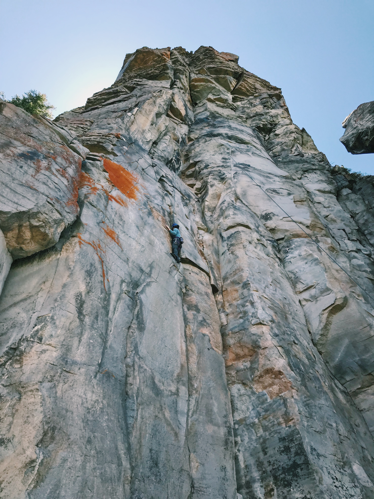
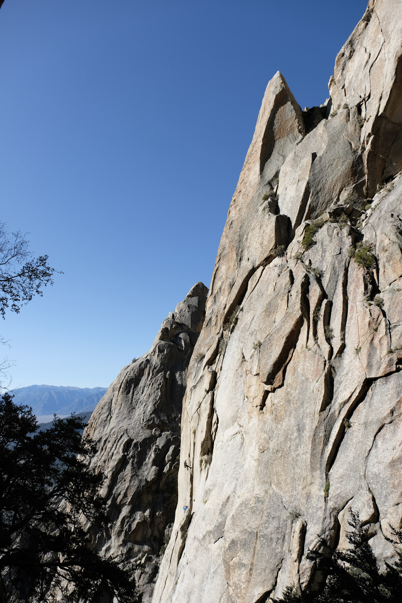
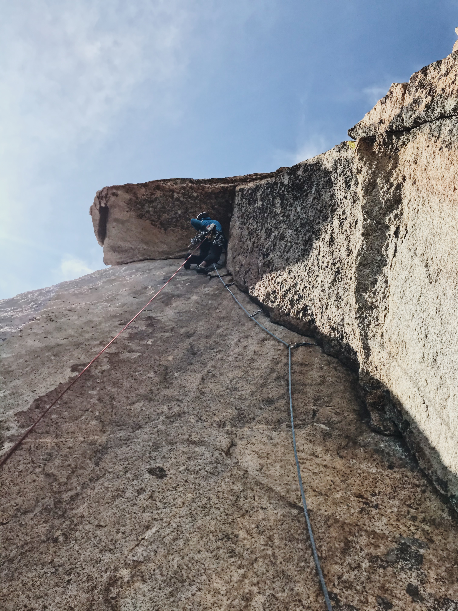
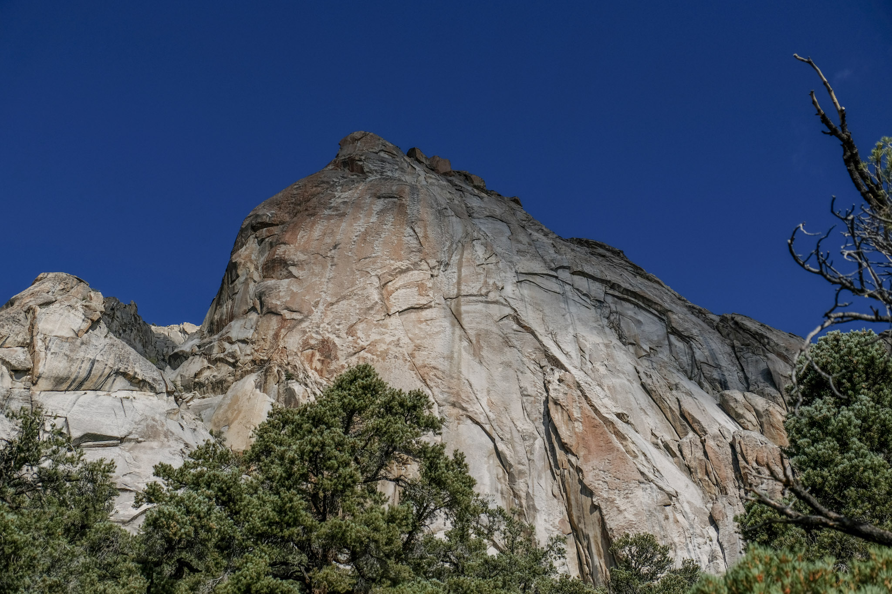
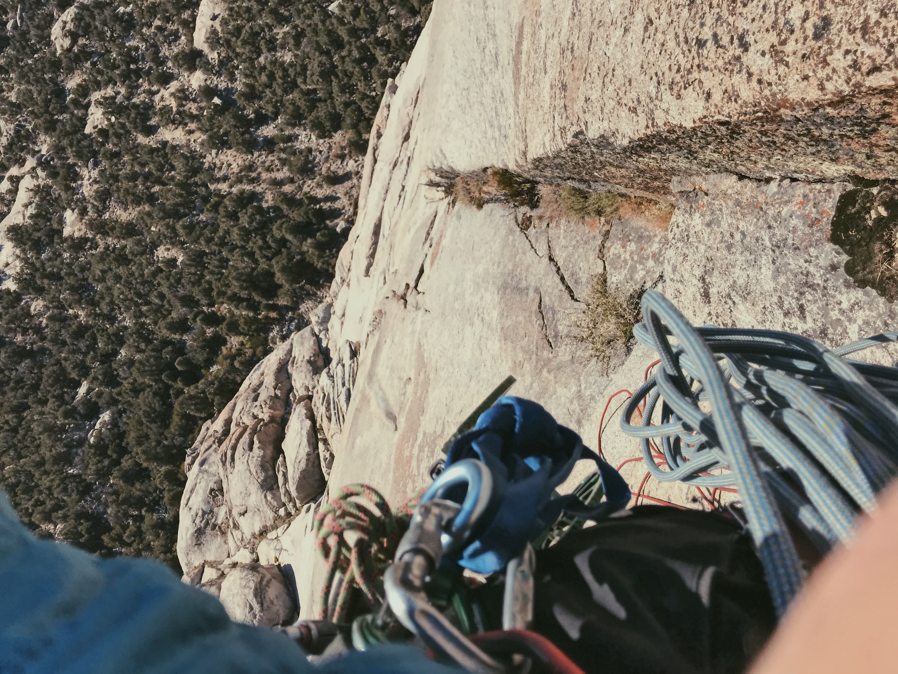
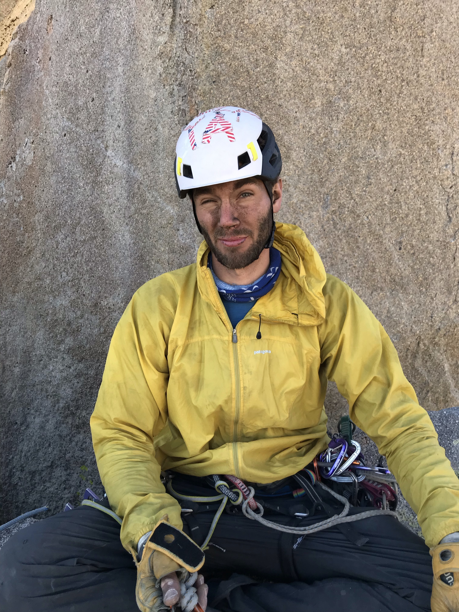

*It's somewhat hard to condense four months of climbing and a third of my FAs into a a couple hundred words, but I'm going to try anyway. I'll also repeat my disclaimer from my Wild Granites post: These are all likely FAs with no evidence of previous passage and much cleaning (except for P1 of Sword of Wotan). Please reach out if you have information on the history and established climbs of the Wild Granites.*

##Jungle on the Aquarius Plateau

One day browsing Mountain Project's map of climbing areas, I saw a blue dot between St. George / Zion and Indian Creek. Hmm, Jungle on the Aquarius Plateau. Groovy. Weird volcanic cliffs at 10,000 feet. Even groovier. Let's check this place out when it's not covered in snow.

On the 4th of July weekend, we got a crew together and started at the Lower Jungle. I hadn't done much climbing on tuff and it took some getting used to. After a couple routes, I felt better and got an itch to explore, so I headed down the trail to see if anything looked interesting. Levi and I had brought the bolt kit, but weren't sure we'd really use it. When I saw the face of Kong Tower with no routes on it though, the adventure was on.

The rock in the Jungle can be quite loose, but generally you find something solid underneath. Many of the cracks will have bolts next to them, which feels like a reasonable safety measure. We found a 4th class, loose traverse through a notch to access the top of the tower, comprised of stacked flakes, like someone had spilled a bag of chips on the floor. Only no matter how far we dug, we couldn't find the floor. We ended up rapping off a buried flake in order to clean the upper loose blocks and set an anchor in a clean section. From there, a first round of hours of cleaning trundled the main loose blocks and used the day's remaining light.

*A friend TRs the new route*

Levi's less-than-burly hammer drill had done well enough in sandstone, but was no match for the bullet tuff at the Jungle. Luckily a friend let us borrow his very nice drill the following day, which made the couple protection bolts go in in no time. Levi was convinced enough to order a new drill right from the crag. We both sent [Bring the Machete](https://www.mountainproject.com/route/117323808/bring-the-machete), climbing across the stair-step edges, up the tips crack, through the hollow flakes, and finally into the hands roof.

##More Drill Shenanigans

I returned to the Jungle in September with Ryan to check out a route he and Roy Suggett, the main developer of the Jungle, had scouted. Opposable Thumbs climbs the left arete of Togo Tower at the Dark Continent and still needed to be bolted. Ryan had just picked up a drill at Lowe's the day before and as he started to place the first bolt, it started smoking...

We were at least three hours from the nearest Lowe's in St. George, two and a half hours from the nearest hardware store, and it was already around 1pm. Nevertheless, we were committed. After our side trip to St. George to exchange the drill, it was dark, but we packed up to do some bolting and cleaning. I started levering blocks off from around a tips and finger crack to the right of Ryan's route under a full moon and decided to call it One Giant Leap for Mankind, aptly next to Evolutionary Leap. Our midnight drill party set up Opposable Thumbs for a lead go and One Giant Leap to suss out the moves.

In the morning, Ryan nearly sent and I felt One Giant Leap would go. Both look like they'll be in the low 13s, so I have something to train for next year.

##The Wild Granites - Part 2

Forest and I had an awesome first trip to the [Wild Granites](/30-fa-project-wild-granites/) and he was psyched to go back to climb some features we had spied, including an absolutely massive hanging corner. We also managed to trick Jack, primarily a strong sport climber, into joining us. Little did he know the soul-crushing force of a pack half your body weight and the sketchiness of loose blocks. He took it like a champ though and might even come back some time...

With our legs adequately fucked and "Penthouse" camp established, we set off on what would become Forbidden Fruit. Two pitches put us below the giant, left-facing corner that we, very incorrectly, thought would be hands. It had a short section of #3s and some fingers pods to start, but the meat was cups, fists, and OW, overhanging for maybe 50m. I have never tried so hard on a pitch. "Just fucking kill me now." "Uuuuuunuunnnnnnnnghhhhhhhh." But that's offwidth; always a fight. 

*The amazing #4s corner on Forbidden Fruit*

Flopping onto the cush ledge above the corner, I knew we'd done a classic. Forest took us to our natural high point just before dark and we rapped back down.

On Saturday, Forest used our fixed ropes to clean a crack in the arete to the right of Forbidden Fruit, while Jack and I pioneered a way to the top of the "Tower of Wotan", named for the giant picnic table at the trailhead inscribed with "Table of Wotan" in Sharpie. The sweet-looking patina arete had caught our eye but we weren't sure it would go or what would connect into it. 

*Sword of Wotan steps left to the arete from the lower-half cracks*

JSF (Just a Suffer Fest or Jack, Sean, and Forest) took the line of least resistance up the back side. As I started up the first pitch, Forest, looking over from the Eden Wall, was concerned. I appeared to be climbing a blank slab with no pro. I was actually climbing a thin flake, carefully testing each section as I pulled up and placing cams as deep and securely as possible. We gained the central ledge, traversed over, climbed up a pretty fun thin crack, and did a couple slab moves to the summit.

The first direction I scouted ended in a very thin and exfoliating slab and would have required climbing a less-than-classic-looking chimney to access. However, the other side led into a crack system that reached the ground and seemed climbable. I found a way through the one question mark section with opposing pressure and a blind reach around a corner. It goes!

Sunday morning I put in our remaining ten bolts in 50m, running it out in the easier spots and protecting the cruxes. I felt it was right and led pitches two and three of [Sword of Wotan](https://www.mountainproject.com/route/117859314/sword-of-wotan) clean.

*Bear hugs lower on P3*

*Thin crimpin' higher on P3*

Pitch one was a bit of a mystery. I found three fixed pins and a bolted anchor. Two of the pins came out by hand, but the crack protects perfectly with c3s and finger pieces. We had to leave the crux tips section for a free lead later as it was pretty burly, insecure 12-.

##Why Not?

Our third trip to the Wild Granites last week should have been to finish establishing Eden Wall, where Forest had cleaned [The Wrath](https://www.mountainproject.com/route/117859274/the-wrath), an insanely aesthetic line up a crack in an arete, and adding some other new lines. But Forest floated the idea of trying a line on the main dome. In just Saturday and half of Sunday, a new 1200' line could be a tall order. Why not though?

On Friday, we hustled to hump gear up to camp and send The Wrath. Forest led the first two pitches combined on my 80m while I simul-climbed the first few feet to give him enough slack to anchor himself. Then came the stem / layback corner on thin gear. Forest got it first go as did I.

*Me following P3 of The Wrath*

The final pitch climbs up through a roof, turning a lip with huge exposure into a layback crack on an arete with a six-inch edge for your feet. It is one of the craziest positions I think I'll ever be in. On his first go, Forest was sending when the rope got stuck in the crack at the lip. We already had a big day, so he was understandably pissed to have to clean the pitch and give it another go. Luckily he still had the juice to redpoint it in enough time to put in an anchor bolt on Sword of Wotan in the dark, so we could start on the main dome the next day. Solid work.

*Forest leads up P4 of The Wrath*

The plaque at the trailhead, the only source of route information we have, did not show any routes up the giant roof crossing the center of the face. From photos, we thought we'd find #6s in the dark crack. That ended up being moss around fingers... Only the first sign of our Delirium.

*The main dome and roof system*

We made liberal use of our brush and nut tools on the first three pitches, burly flare and chimney climbing with a lot of dirt. Pitch four started into the roof system with a splitter #1s and #2s crack. Pitch five, the first of Nevada's leftward Gram traverse, followed sharp underclings in the upper roof to a crux section that felt like 12+. An unexpected perfect .4 crack appeared in the slab under the roof for the last third of the pitch. That was plenty for a long and dirty day 1.

*Some air*

*Cleaning one of the cleaner pitches*

The 5am alarm didn't quite work, so at 5:45 we made coffee and oatmeal, then jugged 600'. Another pitch of underclings with a short 13-(?) aided crux led into another dirty crack system. However, everything climbed really well for the follower once cleaned. Amazed by our luck at another 70m crack pitch but short on time, we angled up and right to obvious and hopefully easier cracks instead of the chimneys looming above. Maybe we'll go that way when we return. We still found engaging climbing and fun movement through a roof and right through lower-angle terrain to the summit ridge to make ten pitches total.

*A dirty, dirty boy*

Absolutely covered in dirt and pleased with our luck, we shared some salami and cheese and an uninterrupted view of the Nevada desert. Delirium went at 5.8 C1 this trip and hopefully 12+/13- with a good bit of hard 10 to 11 climbing when we come back to free it.

I feel so lucky to have had these adventures on my 30 FA Project and I can't wait for the last six climbs before Christmas!

##FAs in this Trip Report
17) [Bring the Machete](https://www.mountainproject.com/route/117323808/bring-the-machete), 5.11b 100'
18) Opposable Thumbs, 5.13a(?) 100'
19) One Giant Leap for Mankind, 5.13-(?) 90'
20) [Forbidden Fruit](https://www.mountainproject.com/route/117859261/forbidden-fruit), 5.11c 4p 600'
21) [JSF (Just a Suffer Fest)](https://www.mountainproject.com/route/117859293/jsf-just-a-suffer-fest), 5.10d PG13 3p 250'
22) [Sword of Wotan](https://www.mountainproject.com/route/117859314/sword-of-wotan), 5.12- R 3p 350'
23) [The Wrath](https://www.mountainproject.com/route/117859274/the-wrath), 5.12a 4p 500'
24) Delirium, 5.8 C1 1200' and we'll be back to free it!

##30 FA Project Summary
24 / 30 FAs on October 6, 2019. Next target is 25 by October 25.