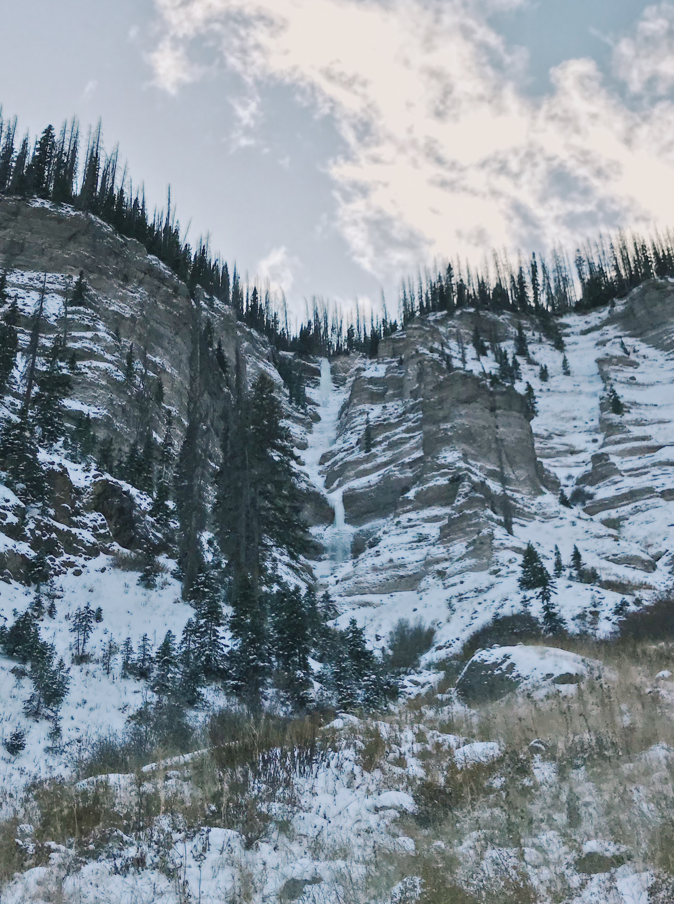
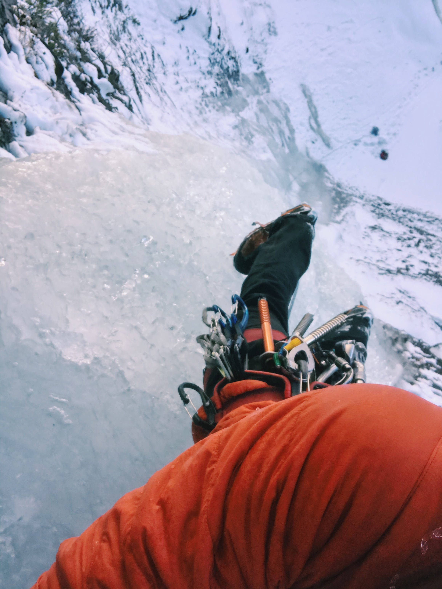
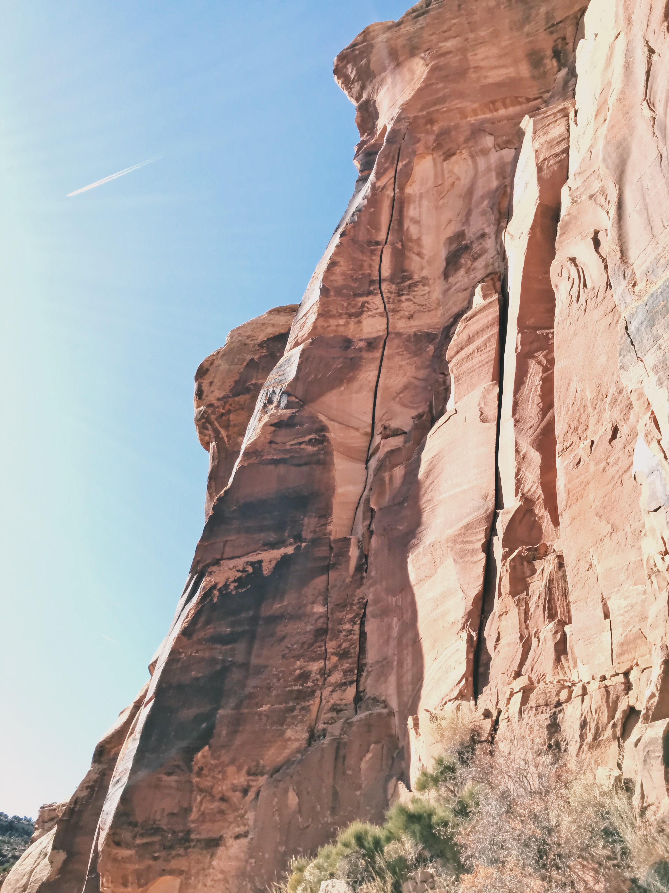
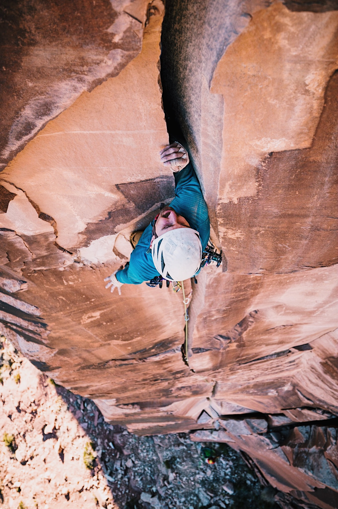
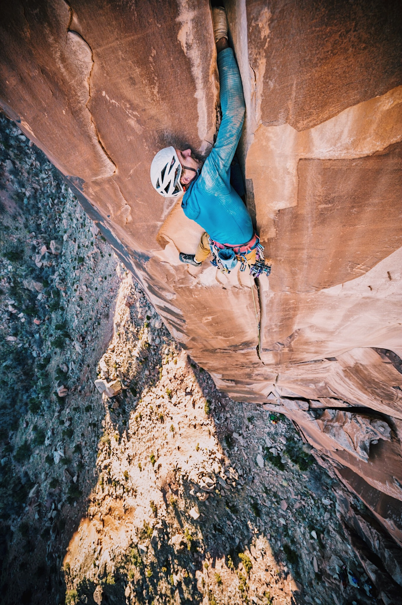
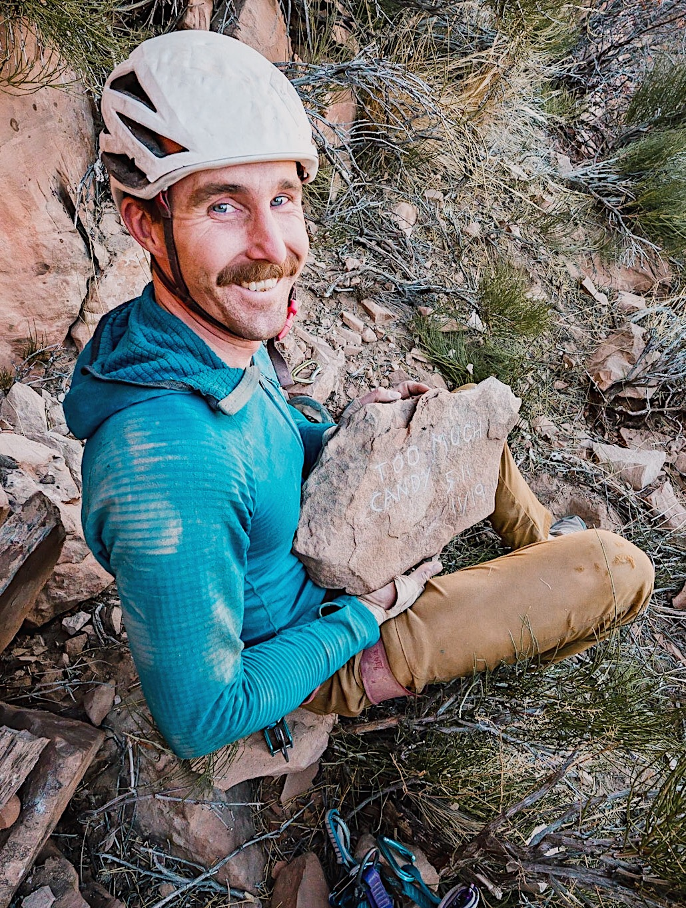
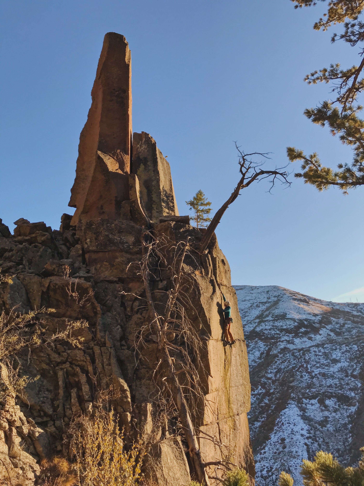

##Chama
On October 29, I sat in the Durango Rec Center's front room, resting my muscles from a strenuous week in Indian Creek and catching up on the internet, when the "Recent Posts" section of Mountain Project caught my eye - "Chama Ice". My chest involuntarily tightened and I clicked on the link. I had been scoping Chama for a year, waiting for ice to come in, and planned to leave in a couple hours to drive there. Previously, there was no mention of ice in Chama Basin anywhere on the internet. Now, someone had gone in on recon, put together an impressively detailed map of ice flows, and posted it to Mountain Project hoping some "real ice climbers" would go climb them. And it was posted just the day before.

"Well, shit! I guess I have to get in there ASAP."

That night I slept at the trailhead. In the morning, I crossed the partially frozen Chama River barefoot, since the water came up to my knees. Fifteen minutes of alternately numb and burning toes shoved in my belay puffy later, I replaced my boots, shouldered my pack, and set to hiking.

I set off to orient myself in the afternoon, after establishing camp in the upper West Fork, and could not understand where the ice was. The map showed a 350' fall in this drainage, but I climbed nearly 2000' to the rim and there had only been WI2. I rechecked my GPS and decided to try for another climb. When I got there, I was surprised by not one but three routes, two of them new. Giddy with excitement but too close to darkness to make a safe attempt, I headed back to camp. No one but a single group of hunters is within fifteen miles. I will still be fast enough!

*The Ghost, WI5 500'*

I get a lazy start once the sun starts to burn off the minus-fifteen-degree cold and tendrils of frost covering my tent interior. The rightmost and proudest line is my first target. A pitch of pure fun WI4 leads to WI3 steps for two rope lengths. Then I take a line up the gently overhanging WI5 pitch to the summit ridge. It's noon on Halloween and I've just done The Ghost. To the left, I make quick work of a short WI3 step and a slightly chandeliered WI4 pillar, Mr. Bones' Wild Ride [(link for the uninitiated)](https://creepypasta.fandom.com/wiki/Mr._Bones%27_Wild_Ride). Finally, I repeat Banded Falls, the route the Mountain Project poster had soloed a couple days earlier.

*Topping out The Ghost*

When I told a couple friends in the local climbing community about what I'd done, they mentioned some griping about the area being "discovered" with the thread on Mountain Project. So far I don't have any record of climbing ice in Chama before this year and the prolific Doug Shepherd never found it in condition. Hit me up if you have any history to add.

##Indian Creek
I returned to the Creek and spent a few days beating myself against unforgiving sandstone. Feeling flagellated, Blayne and I (and his amazing dog Floyd) went in search of new routes at Trick or Treat wall. Blayne had mentioned seeing some potential while climbing Cow Crack, the crag classic. A few options seemed okay but a 40-meter offwidth splitter, unexplicably (one might say "spookily") without chains, was far too cool to pass up.

*Too Much Candy when we first spotted it*

I'm not much of an offwidth climber - the week before I'd top-roped Big Guy and knees/stacks finally started to click - so I was not excited about 40 meters of thrutching. Luckily, I was able to get my knee in most of the route until the last 30' of overhanging rattly fists. On day one, we hand drilled the anchors, trundled the main loose blocks, and made plans to come back tomorrow with all the #5s.

*Getting it back*

Six #5s in hand, I felt ok making an attempt at the FFA. Some friends joined and hid with me as Blayne cleaned more questionable rock. Once we were satisfied it was safe, I gave it a go. Below the final section I tried to gather myself and slow my breathing. I needed all the grunt I had to pull through the awkwardly deep and insecure jams. Here's some good grunting; add your own sound effects:

*Fight!*

At the top I let out a good whoop and felt the pressure melt away. When I touched dirt, I was handed a very nice plaque - "Too Much Candy 5.11 11/19" it read. After Blayne and Doug tried it on TR, we decided against adding a "+", thinking it was maybe just a little harder than Big Baby.

*The afterglow*

##Capulin
For a month, Forest and I had been anticipating our Capulin/Chama Thanksgiving road trip. However, mother nature was being kind of an asshole about Wednesday through Saturday. We thought we could still get three good days in at Capulin Canyon in New Mexico before the storm moved in.

Sunday was my first exposure to the Capulin-tuff style of climbing and I had to work things out through the first few pitches. With the second half of our day, Forest cleaned up what should be a hard new route at the Main Cliff, but our main objective was to check out the Hall of Giants. On Monday, we made the two hour hike to the Hall of Giants to find that it was pretty well climbed out. I wasn't as psyched on trying to make something work there, so we moved over to The Sanctuary.

The first route we tried had a distinct, V-hard-as-shit crux neither of us pulled, easy climbing otherwise, and terrible rock after the first third. It was an easy choice to abandon it. Then we tried an offwidth roof to fists but found anchors at the top. Finally, we got on an easy-looking hand crack corner, which climbed well all the way to the top and got a nice pair of rap rings.

As I hand drilled the 5.9 anchor, Forest went to clean a route I had spied on a "tower". Every couple minutes was punctuated with the crash of loose rocks finding new homes in the talus. I rapped and came over to find Forest microtraxing the crux. I took a turn next and found sweet, engaging discontinuous fingers and off-fingers splitters with unique movement. Pull the rope, get to the bottom, and lead this thing before it's too dark!

*High on P1 of More Witches*

Neither of us fell getting to the ledge at the top of the first pitch just as the sunlight started to fade. I took the bolt kit and the #5 up the final summit block, illuminated pink and orange. Two bolts and an hour later I mantled onto the two-foot-by-one-foot tip of the "flame" for my 30th first ascent - More Witches (5.11+) on The Torch. We have a short celebration and start the hike back to camp.

We planned to return to the Main Cliff and work Forest's route the following day, but the weather changed and a strong breeze picked up. In the morning, I was covered in a layer of dirt and snow inside the tent. Somehow it had blown under the fly and through the mesh on the door. The wind did not relent all morning and four inches of fresh snow coated everything. I would have to stop at 30 for now.

##Acknowledgements
This project would not have been possible without the psych and support of my partners: Forest, Levi, Ryan, Jack, Julia, and Blayne. The routes we did together have a bit of both partners' DNA in them. Thanks for doing the vertical mambo and making babies with me.

##FAs in this Trip Report
25) [The Twoloir](https://www.mountainproject.com/route/117997096/the-twoloir), WI2 800'
26) [The Ghost](https://www.mountainproject.com/route/117997145/the-ghost), WI5 500'
27) [Mr. Bones' Wild Ride](https://www.mountainproject.com/route/117997131/mr-bones-wild-ride), WI4 300'
28) [Too Much Candy](https://www.mountainproject.com/route/117996913/too-much-candy), 5.11 125'
29) [Sloth](https://www.mountainproject.com/route/118115170/sloth), 5.9 70'
30) [More Witches](https://www.mountainproject.com/route/118115217/more-witches), 5.11+ 2p 100'

##30 FA Project Summary
30 / 30 FAs on November 25, 2019!