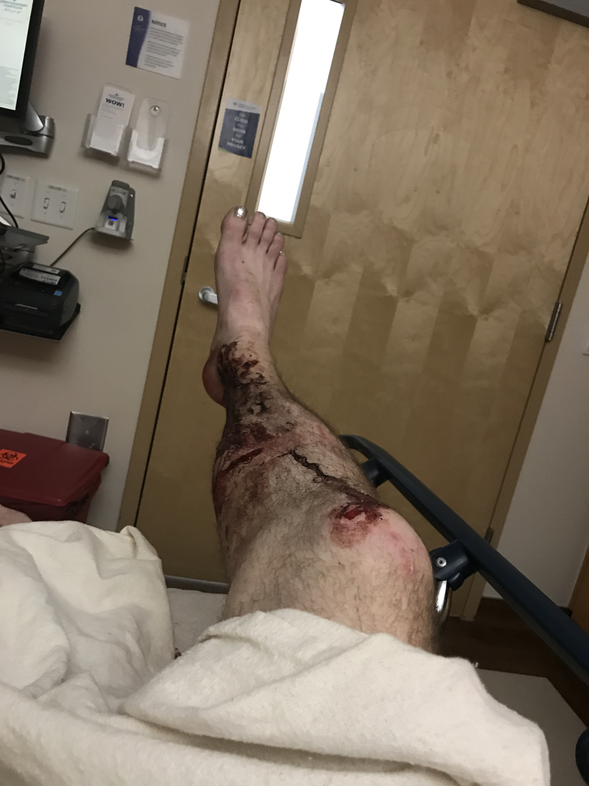
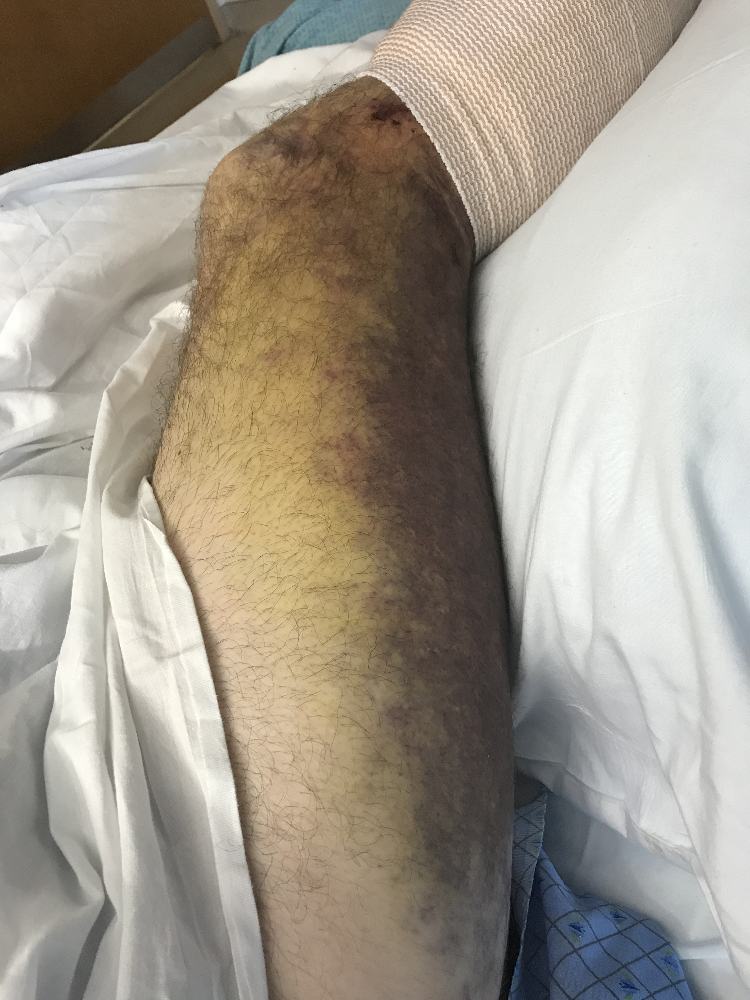
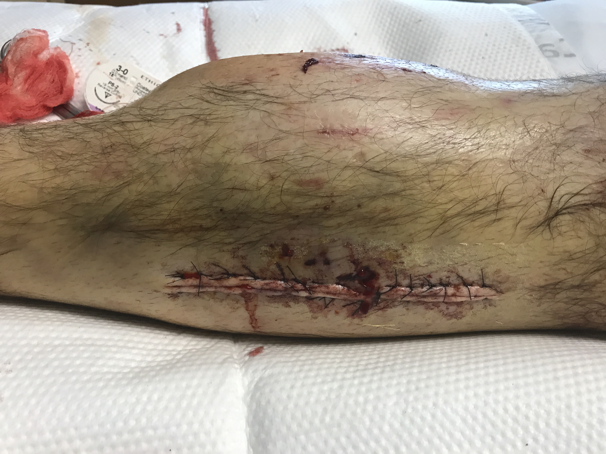
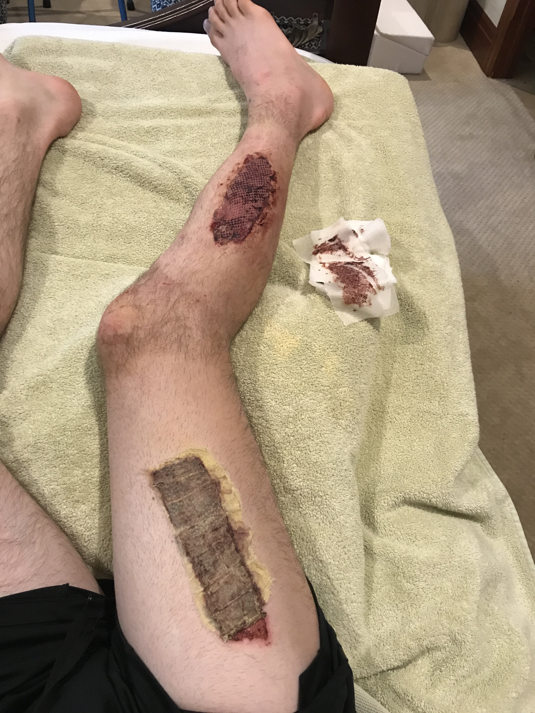
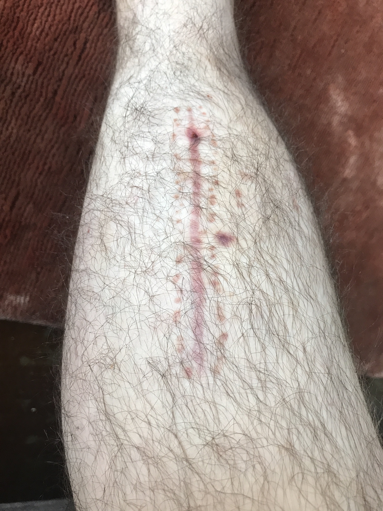

 
 
 
 
 

<em>Warning: Graphic Images of Injury Below</em>

 
 
 
 
 

*I still have a ways to go, but five months out from my injury, I feel I can speak to most of the aspects of my recovery. Searching for experiences with compartment syndrome and fasciotomies did not return much when I was first hurt, so I hope this can help someone else on the road to climbing again.*

 

##Just Another Day
On April 18, a friend and I headed up to try [Gargoyle](https://www.mountainproject.com/route/106036207/gargoyle) in Little Cottonwood Canyon. As we picked our way up the approach gully past the start of the Fin, it started to feel particularly shitty by LCC standards. Steep loose dirt and talus were annoying and a short section of boulder-scrambling seemed a welcome reprieve.

My partner went first, traversing left across a short slab and onto another boulder. I followed, pulling lightly on the same boulder he had used. I felt the oven-sized rock start to shift in my right hand and tried to get out of the way. It gained momentum and rolled over my lower right leg, crushing it from knee to ankle, then barreling down the slope. Knocked backward off the slab, I flipped twice before stopping face-down in the dirt.

<em>We interrupt this story for a public service announcement:  <strong>Get your Wilderness First Responder training!</strong> Now back to our scheduled programming.</em>

It is very hard to stay still after you've been hurt, even when it's been drilled into your head in WFR training. Luckily my partner also had his cert and we stopped to assess my condition. He checked my spine as I started to shiver uncontrollably. Luckily I hadn't hit my head and the shock abated after ten minutes or so. We couldn't tell if I had broken my leg; it hurt to weight but didn't collapse at all. With some swelling, pain, and controlled bleeding, we decided to hike out instead of calling for a rescue.

The next three hours involved butt-scooting, partner-crutching, and frequent stops. The pain and swelling stayed consistent, confirming our choice to self-rescue. I had never been seriously injured before, so I was still holding out hope I would be released quickly from the ER and trying to joke around as my partner patiently waited for me to move the next hundred feet.

##The Hospital
Twenty minutes after reaching the car, I was in the ER. The first doctor told me I probably blew out every ligament in my knee. Not great. We tried to get an MRI to confirm, but I couldn't keep my knee straight long enough without my foot losing all feeling and the pain racheting up elsewhere. A successful ultrasound showed I had also injured the popliteal artery behind my knee.

*Soon after arriving in the hospital with my sparkly toenails*

The main concern, however, was [compartment syndrome](https://www.webmd.com/pain-management/guide/compartment-syndrome-causes-treatments) (swelling in muscles reaches a point where no blood can flow, causing tissue death). My calf had swelled up to nearly twice the size of my left leg and the pain was a constant 5-6 out of 10, ameliorated by the fact I could only feel about 40% of my skin between my knee and ankle from nerve damage. By the evening, the orthopedic doctor had recommended a [fasciotomy](https://en.wikipedia.org/wiki/Fasciotomy), where an incision is made through the fascia lining the muscle to relieve pressure. I would need two, one on each side of my calf. I was told the pain would be almost unbearable once compartment syndrome started, so I chose to wait and see how the pain developed. After 24 hours, the risk of compartment syndrome would be significantly lowered.

*A little swollen*

*A little bruised*

Day two started about how day one ended, monitoring pain and swelling. I tried to keep the amount of pain medication constant, so I would notice changes in pain. Around 2pm, after the 24-hour window and feeling somewhat in the clear, my pain increased to a seven and we prepped for surgery.

I woke up with both sides of my calf flayed open and a "wound vac" sucking on me like a mosquito. The wound vac is attached to a port in a plastic, air-tight dressing over the wound - think cling film. Vacuuming out any serum and keeping negative pressure prevents infection and promotes healing. If set up correctly, you don't see much moving in the clear plastic tube between the port and the device. If not...

##A Couple of Speed Bumps

Day three was my definite emotional low point. Unbeknownst to anyone, the wound vac had been sucking out quite a bit of blood because the dressing did not have a tight seal. Around mid-morning I passed out, crashing from normal blood pressure to 60/30. After an emergency blood transfusion and a little too much ketamine, I regained consciousness very scared. Before that, the nurses had been telling me I was the "healthiest person in the ICU", but maybe I should have been a little more aware that I was still *in the ICU*. And since this all happened early in the COVID crisis, no one was allowed to visit me, which didn't help my emotional state.

One good cry and a couple meals later, my blood work showed I needed another transfusion. The nurse hooked me up and I started to get itchy. Here we go again. My eyes start swelling up as the nurse goes to get a Benadryl shot. Relief follows quickly, as does sleep for the next 13 hours. No one knows why I had a transfusion reaction; I'm less surprised...

Six days after the injury I'm ready to be dischared. The next MRI showed no ligament injuries in my knee(!!!). The incision on the inside of my calf is sewn up and I just have to wait to graft skin onto the outer one. In the meantime, wound vac and bed rest. The most amazing family in the world has offered to take care of me until I can get around on my own. Crutching into the house felt amazing. But later that night I go to the bathroom, get light-headed, and hit my eyebrow on the bathroom countertop. Can't catch a break.

*That's some clean muscle*

*Stitches on the inside cut*

*My distended calf*

##The Road to Walking

One day blends into the next. Wound care comes to rip off the plastic wrap on my leg and replace it every other day. I crutch around with my portable wound vac in a shoulder bag a couple times a day. I keep my ankle still, so I don't stress the wound site. I do minimal physical therapy around my limitations. I think about the future and set a goal to climb the Grand Teton car-to-car in August, three months from now.

*The second day*

*Ready for the graft*

Two weeks after leaving the hospital, I have a follow up with the plastic surgeon. He determines the wound has filled in enough to do the skin graft and schedules me for surgery the following week. They use a glorified vegetable peeler to take skin from my thigh, run it through a glorified pasta roller that punches out holes, stretch it over the wound, and staple it on. I should be able to walk in two weeks.

*Check up after the skin graft*

*Healing a couple days after the graft*

At the end of May I try to walk. My ankle mobility has diminished so far that I can barely flex it. The hobbling with a walker starts to break things up though and physical therapy is more effective. It will take three weeks to walk somewhat normally.

##Climbing Again
Since I arrived in the hospital, I had been on blood thinners to prevent a clot from forming and attaching to my injured artery. I couldn't climb as any bruise could be very serious. It was early July before I got the all clear from the vascular specialist to stop taking the meds. Early on I was told I could have insufficient blood flow for the rest of my life, but I got lucky and don't seem to have any long-term effects.

The first climb felt better than sex. I hadn't lost too much fitness (I kept hangboarding in bed by using a flash board with the cord around my good foot) and climbed clean up to 10d. It took another 4 weeks to send a route I fell on before getting hurt. I proved my arms still worked, but what about my legs?

A couple days after that first climb, I went to the Tetons and did a three-day ascent via the [Black Ice Couloir](https://www.mountainproject.com/route/106646292/black-ice-couloir). My calf survived but was far more tired than usual from standing on frontpoints. Two weeks later, I did the route car-to-car with a lot less fatigue.

*Coming across the back side of the Enclosure on the Grand Teton*

*Back at the trailhead after a successful climb*

Critical to my progress was doing my PT religiously. I went every two weeks to check progress and get new exercises. I only ran after I was cleared by my phystical therapist. I would grit my teeth through the stretches, but the improvement has all been worth the pain.

Currently, five months out, I feel 75% better. There is always an underlying stiffness, especially in the mornings, and I have some imbalances running that I'm still working through. But now I don't even notice it when I'm climbing.

##A Summary
- Final injury tally: compartment syndrome, mild popliteal artery injury, mild tibial plateau fracture / bone bruise
- Time from injury to fasciotomy: ~28 hours
- Time from injury to skin graft: 4 weeks
- Time from injury to walking: 6 weeks
- Time from injury to very easy hiking: 7 weeks
- Time from injury to hiking and easy running: 10 weeks
- Time from injury to artery healed and off blood thinners = climbing: 12 weeks
- Time from injury to Grand Teton summit: 13 weeks
- Time from injury to Grand Teton car-to-car: 16 weeks

*Medial incision five months post-op*

*Lateral skin graft four months post-op*

##Thank Yous
My partner was on top of everything during our self-rescue, while I was in the hospital, and throughout my recovery. I can't thank him enough for all the support.

My hosts for my month and a half of bed rest and surgeries were incredibly kind and helpful. I would not have been able to even live my daily life without them. I count myself very lucky to have them in my community and hope I can eventually repay the kindnesses I was shown.