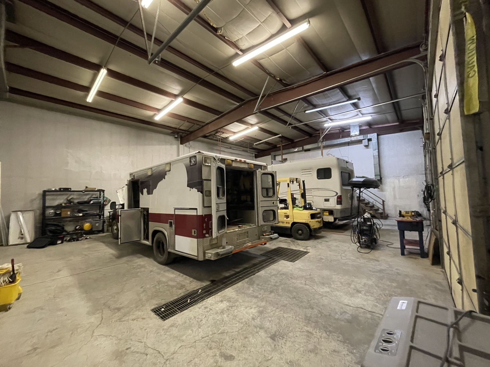

##A New Adventure

Blayne and I hatched the idea for [Mesa Overland](https://www.mesaoverland.com) over the phone this January. Wouldn't it be cool to build the kind of vehicles we always wanted - something that could take you down a 4x4 road and still let you camp comfortably inside? Long phone conversations turned into forming a company, buying a building, and setting up a shop. It's a *LOT* of work but we finally started on [vehicle number one](https://www.mesaoverland.com/builds/thenegotiator) this week!

## The Shop

We started looking near Grand Junction to be in the center of mountain bike culture, near a metropolitan area and airport, and along the interstate. I drove down from Salt Lake to check out all the options. I was the first person to see a building in Mack, Colorado, just off I-70 and ten miles from the border with Utah. It looked like it could use some love, but we both saw the potential immediately. 6000 square feet with an apartment, 14' overhead doors, and a huge back lot. 

*The home of Mesa Overland*

On the first of March, we closed and the next day got our hands dirty. So many things go into turning an empty space into a shop capable of upfitting seven-ton vehicles! A lift, air compressor, welding equipment, Blayne's Snap On collection, fluids, parts, shelving, fire extinguishers, and so much more. Then you have to think about the financing, insurance, accounting, utilities, security systems, etc. Expectations of insanity have helped me keep my sanity these past three weeks. I'm so glad to have a committed and easy-to-get-along-with partner like Blayne. Half the work of a startup is planning and choosing the right people.

*Diesels and a forklift baby!*

## The Plan

The logistics all go into supporting the vision - to build highly capable vehicles with the amenities you would normally find in a Sprinter, and some you won't. Our first vehicle, [The Negotiator](https://www.mesaoverland.com/builds/thenegotiator), is a former ambulance and SWAT team transporter. I drove it from eastern Kansas to western Colorado with no issues, the reliability we love to see from a 7.3 with 175k miles. But when we're done with it, it's going to be a completely different beast - van-style interior with a bike garage, solar with lithium batteries, 4x4 conversion, suspension lift, 20-inch wheels, and 37-inch tires!

We have another 2012 F-550 ambulance with 6'+ of headroom queued up for vehicle number two. And later we will be building removable flatbed campers on Ram and Fummins platforms. But in the meantime, we have to take some day trips to Indian Creek!

*The team - me, Blayne, and Floyd the floof*

If you share our passion for true adventure vehicles and want to know more, send us an email at [info@mesaoverland.com](mailto:info@mesaoverland.com) or give us a call at 970-688-8068. If you just want to heckle us or get outside in the desert, come say hi [here](https://www.mesaoverland.com/about).